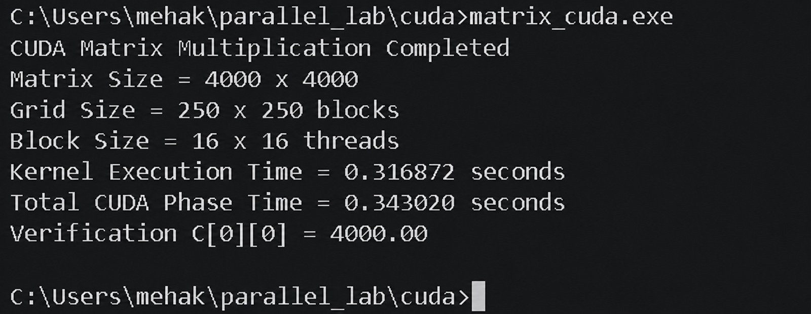

# Part D - CUDA Matrix Multiplication

## 1. CUDA & GPU Setup

CUDA offloads the dense matrix multiplication computation to a massively parallel NVIDIA GPU. The host CPU initializes the input matrices and transfers them to device (GPU) memory via PCIe. A CUDA 2D grid kernel is launched where each physical/logical thread computes one element of the output Matrix $C$.

### Environment Verification

Verify the NVIDIA GPU and driver:
```bash
nvidia-smi
```

Verify the NVIDIA CUDA Compiler (`nvcc`):
```bash
nvcc --version
```

---

## 2. CUDA Execution Configuration

| Parameter | Configuration | Technical Explanation |
| :--- | :--- | :--- |
| **Matrix Size ($N \times N$)** | $4000 \times 4000$ | $16,000,000$ distinct output elements |
| **Thread Block Size** | $16 \times 16$ | 256 threads per thread block |
| **Grid Size** | $250 \times 250$ blocks | $(4000 / 16) \times (4000 / 16) = 62,500$ blocks |
| **Total Logical Threads** | **16,000,000 threads** | $62,500 \times 256$ (1 thread per matrix cell) |

---

## 3. CUDA Matrix Multiplication Program (`matrix_cuda.cu`)

```cuda
#include <stdio.h>
#include <stdlib.h>
#include <cuda_runtime.h>

#define N 4000

// CUDA 2D kernel: each thread computes one element C[row][col]
__global__ void matMulKernel(float *A, float *B, float *C, int n)
{
    int row = blockIdx.y * blockDim.y + threadIdx.y;
    int col = blockIdx.x * blockDim.x + threadIdx.x;

    if (row < n && col < n)
    {
        float sum = 0.0f;
        for (int k = 0; k < n; k++)
        {
            sum += A[row * n + k] * B[k * n + col];
        }
        C[row * n + col] = sum;
    }
}

int main()
{
    size_t bytes = (size_t)N * N * sizeof(float);
    float *h_A, *h_B, *h_C;
    float *d_A, *d_B, *d_C;

    // Allocate host memory
    h_A = (float *)malloc(bytes);
    h_B = (float *)malloc(bytes);
    h_C = (float *)malloc(bytes);

    if (h_A == NULL || h_B == NULL || h_C == NULL)
    {
        printf("Host memory allocation failed\n");
        return 1;
    }

    // Initialize matrices
    for (int i = 0; i < N * N; i++)
    {
        h_A[i] = 1.0f;
        h_B[i] = 1.0f;
        h_C[i] = 0.0f;
    }

    // Allocate device (GPU) memory
    cudaMalloc((void **)&d_A, bytes);
    cudaMalloc((void **)&d_B, bytes);
    cudaMalloc((void **)&d_C, bytes);

    // Create CUDA timing events
    cudaEvent_t totalStart, totalStop;
    cudaEvent_t kernelStart, kernelStop;
    cudaEventCreate(&totalStart);
    cudaEventCreate(&totalStop);
    cudaEventCreate(&kernelStart);
    cudaEventCreate(&kernelStop);

    // Measure total CUDA phase (Transfers + Kernel)
    cudaEventRecord(totalStart);

    // Copy input matrices Host -> Device
    cudaMemcpy(d_A, h_A, bytes, cudaMemcpyHostToDevice);
    cudaMemcpy(d_B, h_B, bytes, cudaMemcpyHostToDevice);

    // 2D Grid and Block execution hierarchy
    dim3 block(16, 16);
    dim3 grid((N + block.x - 1) / block.x, (N + block.y - 1) / block.y);

    // Measure GPU kernel execution time
    cudaEventRecord(kernelStart);
    matMulKernel<<<grid, block>>>(d_A, d_B, d_C, N);
    cudaEventRecord(kernelStop);
    cudaEventSynchronize(kernelStop);

    // Copy result Device -> Host
    cudaMemcpy(h_C, d_C, bytes, cudaMemcpyDeviceToHost);
    cudaEventRecord(totalStop);
    cudaEventSynchronize(totalStop);

    float kernelTime = 0.0f;
    float totalTime = 0.0f;
    cudaEventElapsedTime(&kernelTime, kernelStart, kernelStop);
    cudaEventElapsedTime(&totalTime, totalStart, totalStop);

    printf("CUDA Matrix Multiplication Completed\n");
    printf("Matrix Size = %d x %d\n", N, N);
    printf("Grid Size = %d x %d blocks\n", grid.x, grid.y);
    printf("Block Size = %d x %d threads\n", block.x, block.y);
    printf("Kernel Execution Time = %.6f seconds\n", kernelTime / 1000.0f);
    printf("Total CUDA Phase Time = %.6f seconds\n", totalTime / 1000.0f);
    printf("Verification C[0][0] = %.2f\n", h_C[0]);

    // Cleanup resources
    cudaFree(d_A);
    cudaFree(d_B);
    cudaFree(d_C);
    free(h_A);
    free(h_B);
    free(h_C);

    cudaEventDestroy(totalStart);
    cudaEventDestroy(totalStop);
    cudaEventDestroy(kernelStart);
    cudaEventDestroy(kernelStop);

    return 0;
}
```

---

## 4. Compilation & Execution

```bash
# Compile CUDA C++ program with O2 optimization
nvcc -O2 matrix_cuda.cu -o matrix_cuda.exe

# Execute CUDA matrix multiplication
./matrix_cuda.exe
```

---

## 5. Output Verification

The CUDA program executed successfully across 62,500 thread blocks ($16,000,000$ active threads) and printed exact verification:



---

## 6. Result & Performance Summary

* **Kernel Execution Time**: **0.316872 seconds** (pure GPU computation)
* **Total CUDA Phase Time**: **0.343020 seconds** (Host-to-Device transfer + Kernel + Device-to-Host transfer)
* **Mathematical Verification**: **$C[0][0] = 4000.00$** (PASS)
* **Speedup over Sequential Baseline ($244.120000\text{ s}$)**:
  * **Kernel Speedup**: $\frac{244.120000}{0.316872} = \mathbf{770.40\times}$
  * **End-to-End Speedup (with PCIe memory transfers)**: $\frac{244.120000}{0.343020} = \mathbf{711.68\times}$
