# PART C - Open MPI Distributed Cluster & Matrix Multiplication

## 1. Cluster Topology & Network Architecture

The distributed computing experiment was deployed across a 4-node Ubuntu virtual machine cluster interconnected via a private host-only virtual network on subnet `192.168.190.0/24`:

| Node Name | Hostname | IP Address | Cluster Role | Task Partitioning |
| :--- | :--- | :--- | :--- | :--- |
| **Master** | `master` | `192.168.190.128` | Rank 0 (Coordinator) | Manages cluster; computes rows 0 – 999 |
| **Worker 1** | `worker1` | `192.168.190.129` | Rank 1 (Worker) | Computes rows 1000 – 1999 |
| **Worker 2** | `worker2` | `192.168.190.130` | Rank 2 (Worker) | Computes rows 2000 – 2999 |
| **Worker 3** | `worker3` | `192.168.190.131` | Rank 3 (Worker) | Computes rows 3000 – 3999 |

---

## 2. Network Reachability Verification

Network connectivity from the Master node to all Worker nodes was verified using ICMP `ping` with **0% packet loss**:

```bash
ping -c 4 192.168.190.129
ping -c 4 192.168.190.130
ping -c 4 192.168.190.131
```


---

## 3. SSH Service Configuration & Authentication

### 3.1 OpenSSH Service Status on Worker Nodes
OpenSSH Server was enabled and verified active on all three worker nodes:

| Worker 1 SSH Daemon | Worker 2 SSH Daemon | Worker 3 SSH Daemon |
| :---: | :---: | :---: |
| 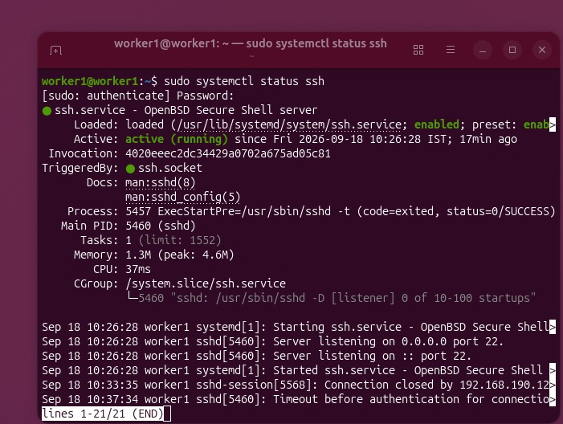 |  |  |

### 3.2 Initial Password-Based Remote Access
Initial connectivity was tested from Master to confirm user accounts:

| Login Worker 1 (`worker1@worker1`) | Login Worker 2 (`worker2@worker2`) | Login Worker 3 (`worker3@worker3`) |
| :---: | :---: | :---: |
| 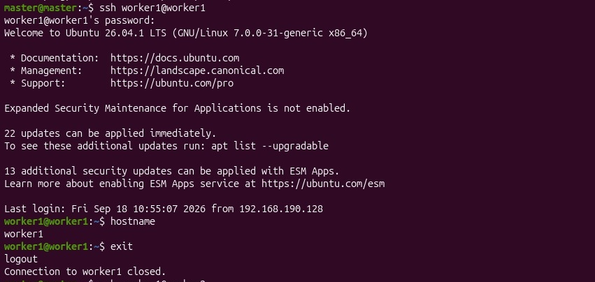 |  | 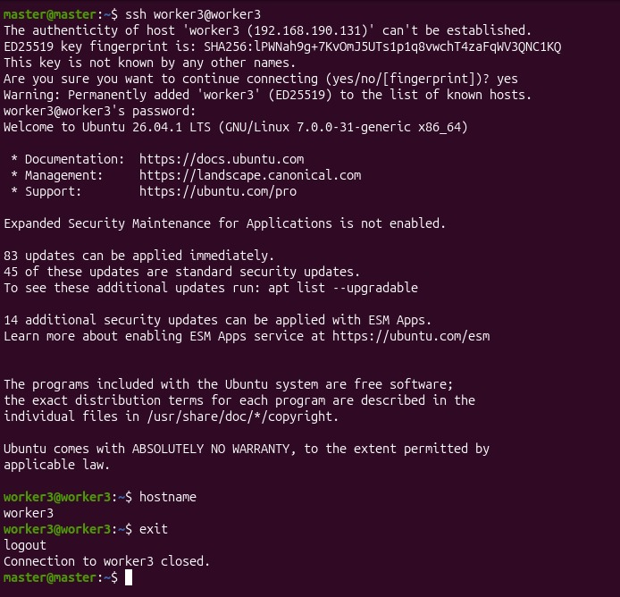 |

---

## 4. Passwordless SSH Key Exchange

To allow `mpirun` to launch processes on remote nodes without human password interaction:

1. **Key Generation on Master**: Generated 3072-bit RSA keypair without passphrase:
   ```bash
   ssh-keygen -t rsa
   ```
   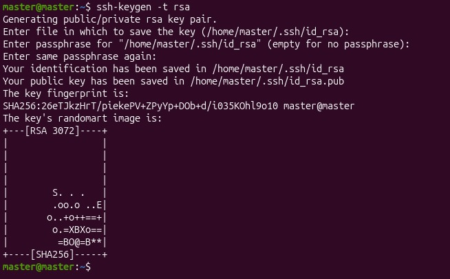

2. **Public Key Distribution**: Installed Master public key into all worker `authorized_keys`:
   ```bash
   ssh-copy-id worker1@worker1
   ssh-copy-id worker2@worker2
   ssh-copy-id worker3@worker3
   ```
   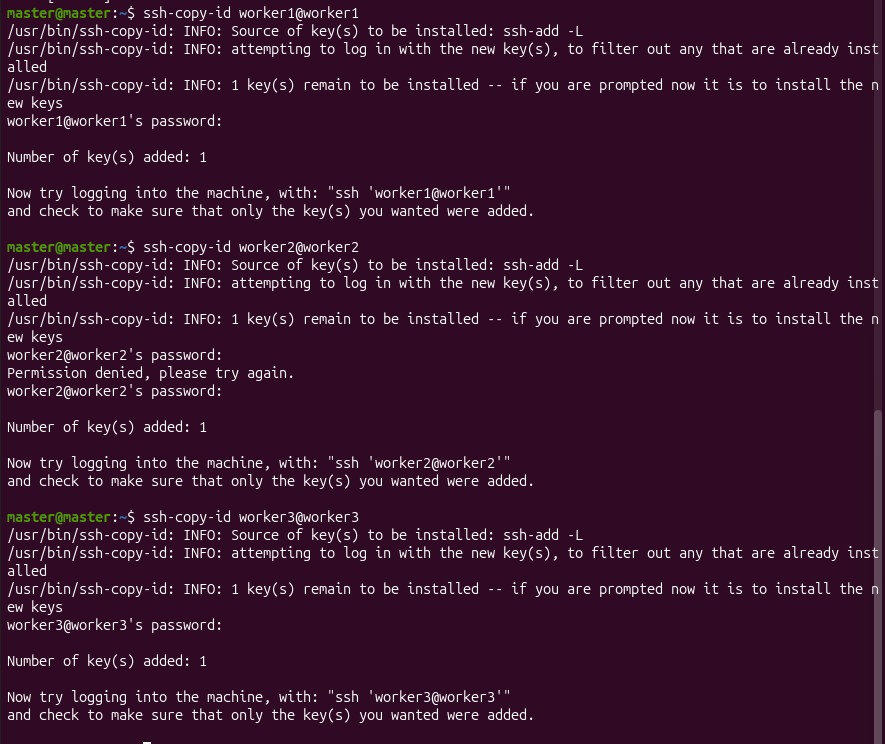

3. **Passwordless Verification**: Verified remote command execution without password prompts:
   ```bash
   ssh worker1 hostname
   ssh worker2 hostname
   ssh worker3 hostname
   ```
   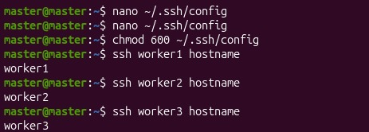

---

## 5. Open MPI Installation & Cluster Toolchain Verification

Open MPI was installed across all cluster nodes using the Ubuntu package manager:

```bash
sudo apt update
sudo apt install openmpi-bin libopenmpi-dev -y
```

### Installation & Verification on Master Node
Verified `mpicc` compiler wrapper, Open MPI 5.0.10 info, and local process launcher:
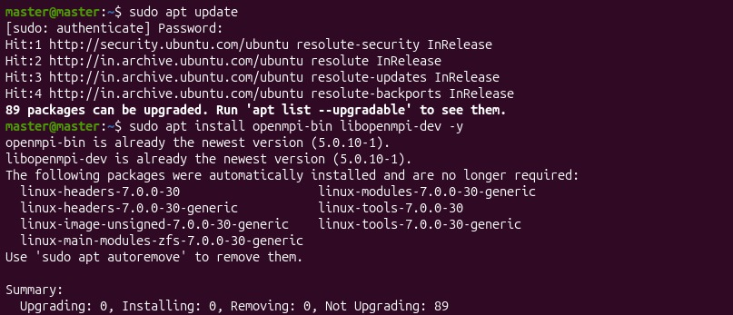
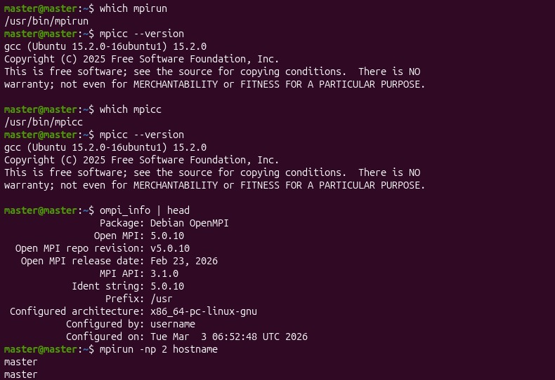

### Installation & Verification on Worker Nodes
Verified Open MPI installation on Worker 1, Worker 2, and Worker 3:
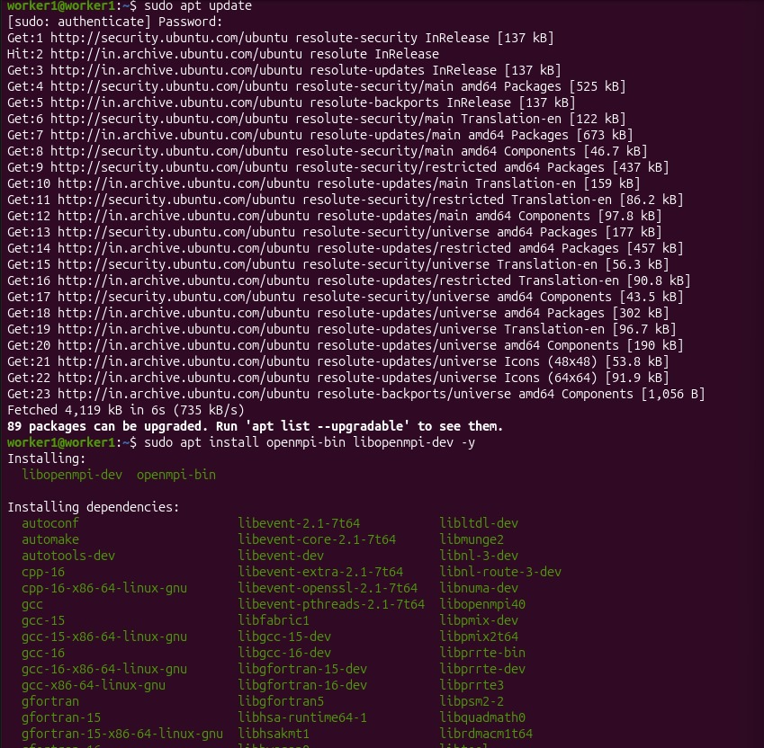

| Worker 1 Verify | Worker 2 Verify | Worker 3 Verify |
| :---: | :---: | :---: |
| 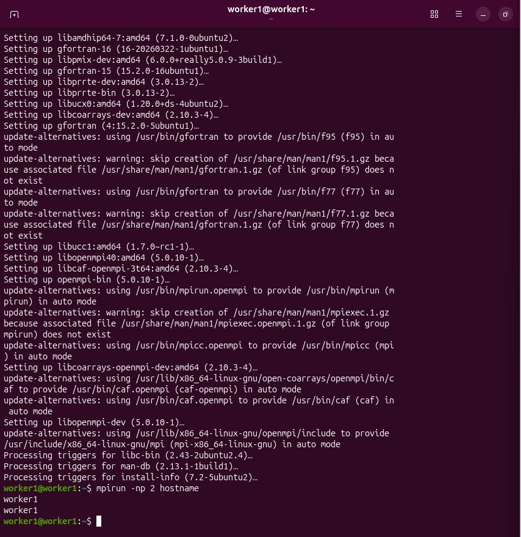 | 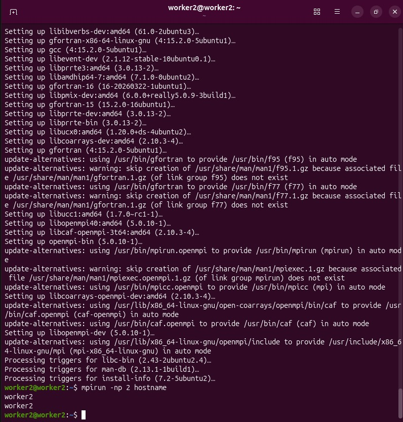 | 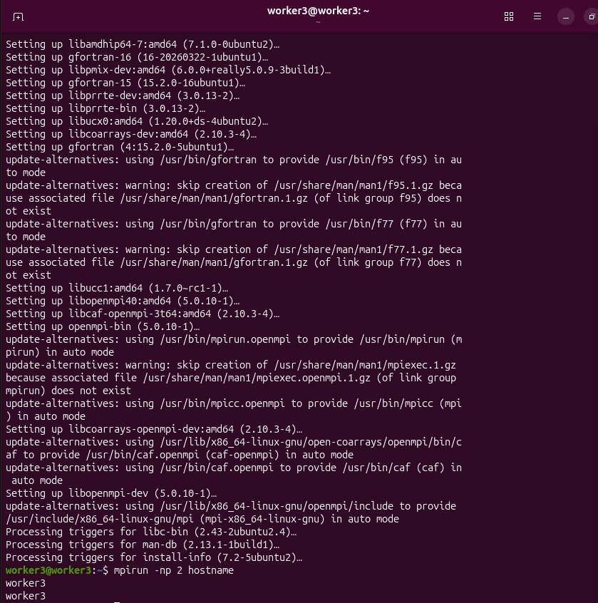 |

---

## 6. Hostfile Configuration & Distributed Message Passing Validation

### 6.1 Hostfile Configuration
Created `hosts` on Master defining the cluster slots:
```text
master slots=1
worker1 slots=1
worker2 slots=1
worker3 slots=1
```

Tested remote process launch across all four nodes:
```bash
mpirun -np 4 --hostfile hosts hostname
```

### 6.2 Point-to-Point Message Passing Verification (`mpi_send_recv.c`)
Before running dense matrix multiplication, a point-to-point program was compiled and distributed across nodes using `scp`:
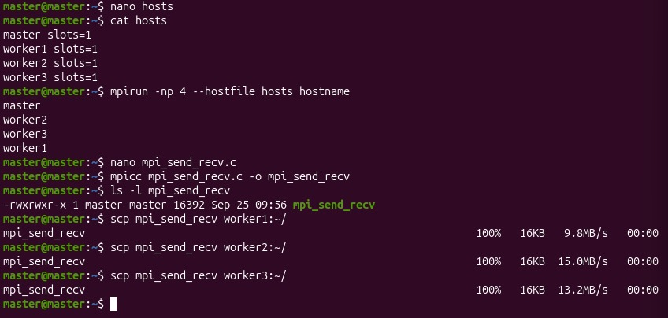

Verified binary availability across all three worker home directories:
| Worker 1 Executable | Worker 2 Executable | Worker 3 Executable |
| :---: | :---: | :---: |
| 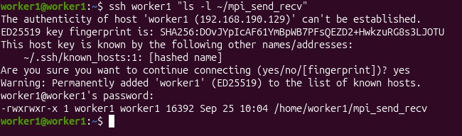 | 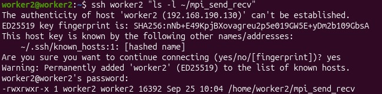 | 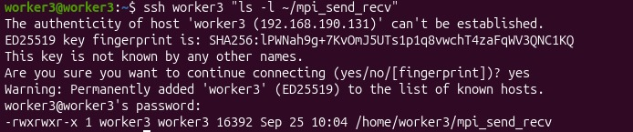 |

Executed the distributed message-passing program across 4 nodes:
```bash
env -u DISPLAY mpirun -np 4 --hostfile hosts sh -c '$HOME/mpi_send_recv'
```
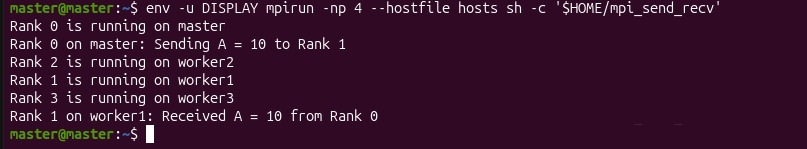

```text
Rank 0 is running on master
Rank 0 on master: Sending A = 10 to Rank 1
Rank 2 is running on worker2
Rank 1 is running on worker1
Rank 3 is running on worker3
Rank 1 on worker1: Received A = 10 from Rank 0
```

---

## 7. Distributed Matrix Multiplication Program

The dense $4000 \times 4000$ matrix multiplication distributes computation across the 4 nodes:
* `MPI_Scatter`: Partitions Matrix $A$ into four 1000-row slices ($32\text{ MB}$ each) from Rank 0 to all workers.
* `MPI_Bcast`: Broadcasts the entire Matrix $B$ ($128\text{ MB}$) to every rank.
* `MPI_Gather`: Assembles computed row slices of Matrix $C$ back onto Rank 0.

```c
#include <stdio.h>
#include <stdlib.h>
#include <mpi.h>
#include <unistd.h>

#define N 4000

int main(int argc, char *argv[])
{
    int rank, size;
    int i, j, k;
    int rows_per_process;
    char hostname[256];

    double *A = NULL;
    double *B = NULL;
    double *C = NULL;
    double *local_A;
    double *local_C;

    double start, end;

    MPI_Init(&argc, &argv);

    MPI_Comm_rank(MPI_COMM_WORLD, &rank);
    MPI_Comm_size(MPI_COMM_WORLD, &size);

    gethostname(hostname, sizeof(hostname));

    if (N % size != 0)
    {
        if (rank == 0)
            printf("Matrix size must be divisible by number of processes.\n");

        MPI_Finalize();
        return 0;
    }

    rows_per_process = N / size;

    local_A = (double *)malloc(rows_per_process * N * sizeof(double));
    local_C = (double *)malloc(rows_per_process * N * sizeof(double));
    B = (double *)malloc(N * N * sizeof(double));

    if (rank == 0)
    {
        A = (double *)malloc(N * N * sizeof(double));
        C = (double *)malloc(N * N * sizeof(double));

        printf("Initializing %d x %d matrices...\n", N, N);

        for (i = 0; i < N; i++)
        {
            for (j = 0; j < N; j++)
            {
                A[i * N + j] = 1.0;
                B[i * N + j] = 1.0;
                C[i * N + j] = 0.0;
            }
        }
    }

    MPI_Barrier(MPI_COMM_WORLD);
    start = MPI_Wtime();

    MPI_Scatter(A, rows_per_process * N, MPI_DOUBLE,
                local_A, rows_per_process * N, MPI_DOUBLE,
                0, MPI_COMM_WORLD);

    MPI_Bcast(B, N * N, MPI_DOUBLE, 0, MPI_COMM_WORLD);

    printf("Rank %d on %s computing %d rows\n", rank, hostname, rows_per_process);

    for (i = 0; i < rows_per_process; i++)
    {
        for (j = 0; j < N; j++)
        {
            local_C[i * N + j] = 0.0;

            for (k = 0; k < N; k++)
            {
                local_C[i * N + j] += local_A[i * N + k] * B[k * N + j];
            }
        }
    }

    MPI_Gather(local_C, rows_per_process * N, MPI_DOUBLE,
               C, rows_per_process * N, MPI_DOUBLE,
               0, MPI_COMM_WORLD);

    MPI_Barrier(MPI_COMM_WORLD);
    end = MPI_Wtime();

    if (rank == 0)
    {
        printf("\nMPI Matrix Multiplication Completed\n");
        printf("Matrix Size = %d x %d\n", N, N);
        printf("Number of MPI Processes = %d\n", size);
        printf("Execution Time = %f seconds\n", end - start);
        printf("Verification C[0][0] = %.2f\n", C[0]);

        free(A);
        free(C);
    }

    free(B);
    free(local_A);
    free(local_C);

    MPI_Finalize();
    return 0;
}
```

---

## 8. Compilation, Staging & Cluster Execution

```bash
# 1. Compile on Master
mpicc -O2 matrix_mpi.c -o matrix_mpi

# 2. Stage executable to all Worker nodes
scp matrix_mpi worker1:~/matrix_mpi
scp matrix_mpi worker2:~/matrix_mpi
scp matrix_mpi worker3:~/matrix_mpi

# 3. Launch distributed job across cluster
mpirun -np 4 --hostfile hosts sh -c '$HOME/matrix_mpi'
```

---

## 9. Final Benchmark Result & Verification

```text
Initializing 4000 x 4000 matrices...
Rank 0 on master computing 1000 rows
Rank 1 on worker1 computing 1000 rows
Rank 2 on worker2 computing 1000 rows
Rank 3 on worker3 computing 1000 rows

MPI Matrix Multiplication Completed
Matrix Size = 4000 x 4000
Number of MPI Processes = 4
Execution Time = 92.979510 seconds
Verification C[0][0] = 4000.00
```

### Metrics Summary:
* **Execution Time ($T_{mpi}$)**: **`92.979510 seconds`**
* **Sequential Baseline ($T_{seq}$)**: `244.120000 seconds`
* **Speedup over Sequential**: $\frac{244.120000}{92.979510} \approx \mathbf{2.63\times}$
* **Parallel Efficiency**: $\frac{2.63}{4} \approx \mathbf{65.8\%}$
* **Verification Status**: $C[0][0] = 4000.00$ (**PASSED**)
