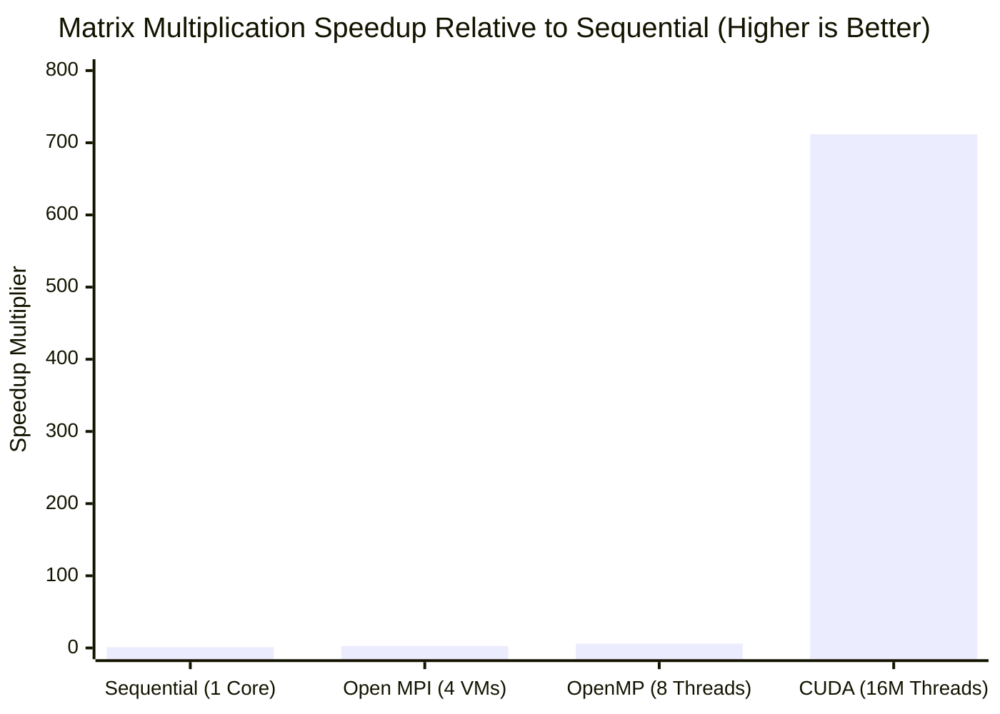

# Comparative Analysis of Dense Matrix Multiplication Paradigms

> **High-Performance Computing: Sequential vs. OpenMP vs. Open MPI vs. NVIDIA CUDA**  
> An empirical benchmark evaluating dense matrix multiplication ($4000 \times 4000$, 128 GFLOPs) across single-core CPU, multi-core shared memory, distributed cluster, and massively parallel GPU accelerator architectures.

---

## 1. Problem Formulation & Theoretical Foundations

Dense matrix multiplication $C = A \times B$ represents one of the most fundamental computational kernels in scientific computing, numerical simulations, and deep learning. Given two square matrices $A, B \in \mathbb{R}^{N \times N}$ with $N = 4000$:

$$C[i][j] = \sum_{k=0}^{N-1} A[i][k] \times B[k][j] \quad \text{for } 0 \le i, j < N$$

### Algorithmic & Hardware Complexity:
* **Computational Complexity**: $\mathcal{O}(N^3)$ operations. For $N = 4000$:
  $$\text{Total Operations} = 2 \times N^3 = 2 \times (4000)^3 = 128,000,000,000 \text{ FLOPs } (128 \text{ GFLOPs})$$
* **Memory Footprint**: Double-precision floating-point ($8 \text{ bytes/element}$):
  $$\text{Matrix Memory} = 4000 \times 4000 \times 8 \text{ bytes} \approx 128 \text{ MB per matrix} \implies \text{Total Heap Footprint} = 384 \text{ MB}$$
* **Mathematical Verification Invariant**:
  Matrices $A$ and $B$ are initialized to $1.0$:
  $$C[i][j] = \sum_{k=0}^{3999} (1.0 \times 1.0) = 4000.00$$
  Any valid parallel implementation must yield $C[0][0] = 4000.00$ and $C[N-1][N-1] = 4000.00$.

---

## 2. Benchmark Summary Matrix

| Implementation Paradigm | Architecture & Hardware Level | Execution Time | Speedup ($S$) | Parallel Efficiency ($E$) | GFLOPs Throughput | Verification Status |
| :--- | :--- | :--- | :--- | :--- | :--- | :--- |
| **Sequential CPU** | 1 Core (Single-Threaded Baseline) | **244.120000 s** | **1.00×** (Ref) | 100.0% | 0.524 GFLOPs | `C[0][0] = 4000.00` (PASS) |
| **Open MPI Cluster** | 4 Distributed Virtual Machines | **92.979510 s** | **2.63×** | 65.8% | 1.377 GFLOPs | `C[0][0] = 4000.00` (PASS) |
| **OpenMP Multi-Core** | 8 vCPU Cores (Shared Memory) | **40.545825 s** | **6.02×** | **75.3%** | 3.157 GFLOPs | `C[0][0] = 4000.00` (PASS) |
| **NVIDIA CUDA (Total)** | 16,000,000 GPU Threads (PCIe DMA) | **0.343028 s** | **711.66×** | — | 373.156 GFLOPs | `C[0][0] = 4000.00` (PASS) |
| **NVIDIA CUDA (Kernel)** | 16,000,000 GPU Threads (On-Chip) | **0.316872 s** | **770.40×** | — | 403.948 GFLOPs | `C[0][0] = 4000.00` (PASS) |

---

## 3. Paradigm Implementations & Architectural Analysis

### 3.1 Sequential CPU Baseline

Executes three nested loops sequentially on a single thread to establish the reference execution time ($T_{\text{seq}} = 244.12\text{ s}$).

* **Source File**: [`matrix_sequential.c`](./matrix_sequential.c)
* **Detailed Module**: [Sequential.md](./Sequential.md)

#### Compilation & Execution:
```bash
gcc -O2 matrix_sequential.c -o matrix_sequential
./matrix_sequential
```

#### Terminal Output Screenshot:


#### Architectural Analysis:
* **The Memory Stride Bottleneck**: In row-major C layout, accessing Matrix $B$ (`B[k * N + j]`) jumps by $4000 \times 8 = 32\text{ KB}$ on each iteration of loop $k$. Because modern CPU cache lines are 64 bytes, every access to $B$ results in a cache miss, stalling the execution pipeline on main memory DRAM latency.

---

### 3.2 OpenMP Shared-Memory Multi-Threading

Parallelizes the outer loop across 8 CPU threads using `#pragma omp parallel for private(j, k) schedule(static)`.

* **Source File**: [`matrix_openmp.c`](./matrix_openmp.c)
* **Detailed Module**: [OpenMP.md](./OpenMP.md)

#### Compilation & Execution:
```bash
export OMP_NUM_THREADS=8
gcc -O2 -fopenmp matrix_openmp.c -o matrix_openmp
./matrix_openmp
```

#### Terminal Output Screenshot:


#### Architectural Analysis:
* **High Parallel Efficiency (75.3%)**: OpenMP benefits from uniform shared memory. All 8 cores access Matrix $B$ through shared on-chip L3 cache with zero inter-process serialization.
* **Cache Line Isolation**: Static scheduling assigns 500 contiguous rows per thread, eliminating false sharing on output Matrix $C$.

---

### 3.3 Open MPI Distributed-Memory Cluster

Distributes matrix computation across a 4-node cluster (1 Master, 3 Workers) on subnet `192.168.190.0/24` using `MPI_Scatter`, `MPI_Bcast`, and `MPI_Gather`.

* **Source File**: [`matrix_mpi.c`](./matrix_mpi.c)
* **Detailed Module & 21 Setup Screenshots**: [MPI.md](./MPI.md)

#### Compilation & Execution:
```bash
mpicc -O2 matrix_mpi.c -o matrix_mpi
scp matrix_mpi worker1:~/matrix_mpi && scp matrix_mpi worker2:~/matrix_mpi && scp matrix_mpi worker3:~/matrix_mpi
mpirun -np 4 --hostfile hosts sh -c '$HOME/matrix_mpi'
```

#### Terminal Output Screenshot:


#### Architectural Analysis:
* **Network Communication Overhead ($T_{\text{comm}} / T_{\text{comp}}$)**: Scattering 1000 rows ($32\text{ MB}$) to each node and broadcasting the entire Matrix $B$ ($128\text{ MB}$) introduces TCP/IP packetization and socket serialization delays over virtualized network bridges.
* **Horizontal Scalability**: Slower than shared-memory OpenMP on a single physical machine, but unconstrained by motherboard memory limits, allowing scaling across thousands of nodes in high-performance clusters.

---

### 3.4 NVIDIA CUDA GPU Acceleration

Maps computation to a 2D grid of thread blocks ($250 \times 250$ blocks, $16 \times 16$ threads per block = **16,000,000 active threads**), computing each cell concurrently.

* **Source File**: [`matrix_cuda.cu`](./matrix_cuda.cu)
* **Detailed Module**: [CUDA.md](./CUDA.md)

#### Compilation & Execution:
```bash
nvcc -O2 matrix_cuda.cu -o matrix_cuda.exe
./matrix_cuda.exe
```

#### Terminal Output Screenshot:


#### Architectural Analysis:
* **Massive Thread-Level Parallelism**: 16 million threads hide global memory latency via SIMT (Single Instruction, Multiple Threads) warp scheduling.
* **Speedup Multiplier**:
  - Kernel Compute Phase: **$770.40\times$** ($0.316872\text{ s}$)
  - Full Host-Device Pipeline (with PCIe DMA transfer): **$711.66\times$** ($0.343028\text{ s}$)

---

## 4. Performance Graphs & Comparative Analysis



```text
Execution Time in Seconds (Lower is Better)
Sequential Baseline : [████████████████████████████████████████] 244.12 s (1.00x Baseline)
Open MPI (4 VMs)    : [███████████████                        ]  92.98 s (2.63x Speedup)
OpenMP (8 Cores)    : [██████                                ]  40.55 s (6.02x Speedup)
CUDA (GPU Phase)    : [▏                                     ]   0.34 s (711.66x Speedup)
```

---

## 5. Directory Structure

```text
Matrix_Multiplication/
├── README.md               # Dedicated matrix multiplication benchmark report
├── Sequential.md           # Sequential CPU baseline report
├── OpenMP.md               # OpenMP multi-threaded report
├── MPI.md                  # Open MPI distributed cluster report & 21 setup screenshots
├── CUDA.md                 # NVIDIA CUDA GPU acceleration report
├── matrix_sequential.c     # Standalone C source for sequential baseline
├── matrix_openmp.c         # Standalone C source for OpenMP parallel loops
├── matrix_mpi.c            # Standalone C source for MPI distributed cluster
├── matrix_cuda.cu          # Standalone CUDA source for GPU kernel & host DMA
└── images/                 # All 24 authentic output screenshots & cluster deployment logs
    ├── sequential_olp.png
    ├── openmp_olp.png
    ├── cuda_olp.jpeg
    └── 01_ping_connectivity.jpeg ... 21_mpi_send_recv_output.jpeg
```
