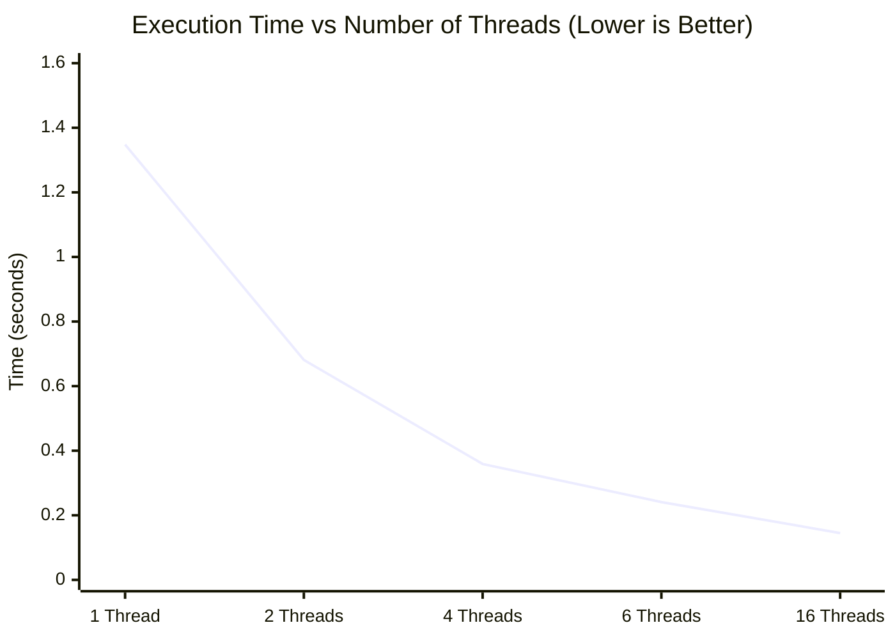
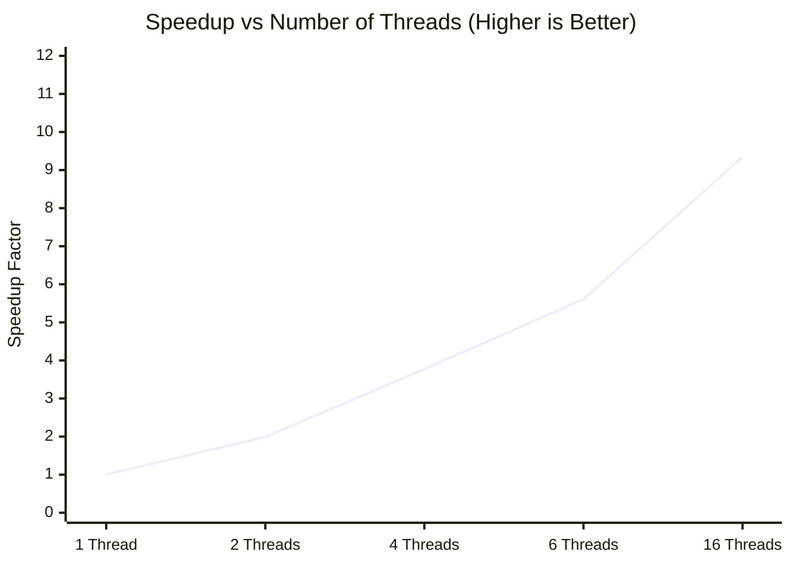

# Multithreaded Programming Using Pthreads and OpenMP

> **Laboratory Manual & Performance Study**  
> Developed based on the laboratory reference guide: *Develop Multithreaded Programs Using Parallel Programming Libraries to Understand Thread Creation, Management, and Coordination*.

---

## 1. Aim

To develop multithreaded programs using **POSIX Threads (Pthreads)** and **OpenMP** to understand:
- Thread creation and lifecycle management
- Work distribution across cores
- Concurrency hazards (race conditions)
- Synchronization primitives (mutexes and critical sections)
- Thread coordination (barriers)
- Empirical performance scaling across increasing thread counts

---

## 2. Basic Concept of Multithreading

A thread is an independent execution path inside a program. In a sequential program, a single thread executes all tasks one after another:

```text
Sequential Program (Single Worker):
Main Thread ─── Task 1 ─── Task 2 ─── Task 3 ─── Task 4 ─── Finish
```

In a multithreaded program, the workload is partitioned across multiple concurrent worker threads:

```text
Multithreaded Program (Parallel Workers):
                ┌─── Thread 1 ─── Chunk 1 ───┐
                ├─── Thread 2 ─── Chunk 2 ───┤
Program Spawn ──┼─── Thread 3 ─── Chunk 3 ───┼─── Join & Aggregate
                └─── Thread 4 ─── Chunk 4 ───┘
```

---

## 3. Environment & Setup

- **Operating System**: Windows 11 with WSL Ubuntu 22.04 LTS
- **Compiler**: GCC with `-pthread` and `-fopenmp` support
- **Verification Commands**:
  ```bash
  gcc --version
  gcc -fopenmp --version
  ```

---

## 4. Part A — POSIX Threads (Pthreads)

Pthreads provides explicit low-level control over thread lifecycles using:
- `pthread_create()`: Spawns an additional thread
- `pthread_join()`: Blocks until the specified thread terminates
- `pthread_mutex_lock()` / `pthread_mutex_unlock()`: Enforces mutual exclusion

---

### Step 1: Create One Thread (`thread1.c`)

Demonstrates spawning a single additional worker thread that executes `thread_function` concurrently while the main thread waits.

* **Source File**: [`thread1.c`](./thread1.c)
* **Compile & Run**:
  ```bash
  gcc thread1.c -o thread1 -pthread
  ./thread1
  ```
* **Expected Output**:
  ```text
  Hello from the thread!
  Main thread finished.
  ```

---

### Step 2: Create Multiple Threads (`thread2.c`)

Spawns 4 worker threads inside a loop and passes each thread its numeric identifier.

* **Source File**: [`thread2.c`](./thread2.c)
* **Compile & Run**:
  ```bash
  gcc thread2.c -o thread2 -pthread
  ./thread2
  ```
* **Expected Output** (Order may vary due to OS scheduling):
  ```text
  Hello from Thread 1
  Hello from Thread 3
  Hello from Thread 2
  Hello from Thread 4
  All threads have finished.
  ```
* **Key Concept**: The OS kernel scheduler decides execution order; thread completion sequence is non-deterministic.

---

### Step 3: Divide Work Among Threads (`thread_sum.c`)

Distributes an 8-element array `[10, 20, 30, 40, 50, 60, 70, 80]` across 4 threads, where each thread computes a contiguous 2-element chunk.

* **Source File**: [`thread_sum.c`](./thread_sum.c)
* **Compile & Run**:
  ```bash
  gcc thread_sum.c -o thread_sum -pthread
  ./thread_sum
  ```
* **Expected Output**:
  ```text
  Thread 1 calculated sum = 30
  Thread 2 calculated sum = 70
  Thread 3 calculated sum = 110
  Thread 4 calculated sum = 150
  Total sum = 360
  ```
* **Mathematical Check**: $30 + 70 + 110 + 150 = 360$.

---

### Step 4: Demonstrate a Race Condition (`race.c`)

Four threads concurrently increment a shared global integer `counter` 100,000 times each without synchronization. Expected total: $4 \times 100,000 = \mathbf{400,000}$.

* **Source File**: [`race.c`](./race.c)
* **Compile & Run**:
  ```bash
  gcc race.c -o race -pthread
  ./race
  ```
* **Observed Output**:
  ```text
  Expected counter = 400000
  Actual counter   = 167739
  ```
* **Why Updates Are Lost**: The operation `counter++` is non-atomic and compiles to three machine instructions:
  1. `MOV EAX, [counter]` (Read from RAM into CPU register)
  2. `ADD EAX, 1` (Increment register value)
  3. `MOV [counter], EAX` (Store back to RAM)

  When Thread 1 and Thread 2 read the same value (e.g., `10`) concurrently, both write back `11`, losing one increment.

---

### Step 5: Fix Race Condition Using Mutex (`mutex.c`)

Protects the critical update using a POSIX mutual exclusion lock (`pthread_mutex_t`).

* **Source File**: [`mutex.c`](./mutex.c)
* **Compile & Run**:
  ```bash
  gcc mutex.c -o mutex -pthread
  ./mutex
  ```
* **Observed Output**:
  ```text
  Expected counter = 400000
  Actual counter   = 400000
  ```
* **Mechanism**: `pthread_mutex_lock(&mutex)` allows only one thread inside the increment block at any instant, guaranteeing 100% data integrity.

---

## 5. Part B — OpenMP Directives

OpenMP provides a high-level, compiler-driven model that handles thread pools automatically using `#pragma omp` directives.

---

### Step 6: Basic Parallel Region (`omp1.c`)

Spawns a team of threads and queries individual thread ranks and total team size.

* **Source File**: [`omp1.c`](./omp1.c)
* **Compile & Run**:
  ```bash
  gcc omp1.c -o omp1 -fopenmp
  ./omp1
  ```
* **Terminal Output Screenshot**:
  

---

### Step 7: Work-Sharing Reduction (`omp_sum.c`)

Distributes loop iterations across threads and combines partial results using `#pragma omp parallel for reduction(+:total_sum)`.

* **Source File**: [`omp_sum.c`](./omp_sum.c)
* **Compile & Run**:
  ```bash
  gcc omp_sum.c -o omp_sum -fopenmp
  ./omp_sum
  ```
* **Terminal Output Screenshot**:
  

---

### Step 8: OpenMP Race Condition (`omp_race.c`)

Demonstrates that OpenMP does not automatically protect shared variables from concurrent writes.

* **Source File**: [`omp_race.c`](./omp_race.c)
* **Compile & Run**:
  ```bash
  gcc omp_race.c -o omp_race -fopenmp
  ./omp_race
  ```
* **Terminal Output Screenshot**:
  
* **Observed Result**: Actual counter recorded **`100,182`** instead of **`400,000`** (losing **299,818 updates**).

---

### Step 9: OpenMP Critical Section (`omp_critical.c`)

Enforces mutual exclusion using `#pragma omp critical`.

* **Source File**: [`omp_critical.c`](./omp_critical.c)
* **Compile & Run**:
  ```bash
  gcc omp_critical.c -o omp_critical -fopenmp
  ./omp_critical
  ```
* **Terminal Output Screenshot**:
  
* **Observed Result**: Expected: **`400,000`**, Actual: **`400,000`** (**zero lost updates**).

---

### Step 10: Phased Barrier Coordination (`omp_barrier.c`)

Ensures all threads finish Stage 1 before ANY thread begins Stage 2 using `#pragma omp barrier`.

* **Source File**: [`omp_barrier.c`](./omp_barrier.c)
* **Compile & Run**:
  ```bash
  gcc omp_barrier.c -o omp_barrier -fopenmp
  ./omp_barrier
  ```
* **Terminal Output Screenshot**:
  

---

## 6. Part C — Performance Analysis & Scalability

To evaluate real-world scaling, a compute-intensive numerical summation workload over $N = 1,000,000,000$ elements ($10^9$) was executed across Sequential, Pthreads, and OpenMP implementations:

$$\text{Target Mathematical Invariant: } \sum_{i=0}^{N-1} (i \times 10^{-6}) = \mathbf{499999999500.00}$$

---

### Step 11: Sequential Baseline (`sequential.c`)

* **Source File**: [`sequential.c`](./sequential.c)
* **Compile & Run**:
  ```bash
  gcc -O2 sequential.c -o sequential && ./sequential
  ```
* **Terminal Output Screenshot**:
  
* **Reference Baseline Execution Time**: **`1.353219 seconds`** (Average over 5 independent runs: 1.353895s, 1.355794s, 1.349621s, 1.353422s, 1.353365s).

---

### Step 12 & 13: Pthreads Performance Benchmarks (`pthread_perf.c`)

* **Source File**: [`pthread_perf.c`](./pthread_perf.c)
* **Compile**:
  ```bash
  gcc -O2 -pthread pthread_perf.c -o pthread_perf
  ```
* **Screenshots**:
  - **1 & 2 Threads** (`0.891180 s`):
    
  - **6 Threads** (`0.345706 s`):
    
  - **16 Threads** (`0.216248 s`):
    

---

### Step 14: OpenMP Performance Benchmarks (`omp_perf.c`)

* **Source File**: [`omp_perf.c`](./omp_perf.c)
* **Compile**:
  ```bash
  gcc -O2 -fopenmp omp_perf.c -o omp_perf
  ```
* **Screenshot**:
  - **1 & 4 Threads** (4T: `0.487638 s`):
    

---

### Step 15: Measured Execution Time Comparison Table

| Thread Count ($P$) | Sequential Baseline | Pthreads Execution Time | OpenMP Execution Time |
| :--- | :--- | :--- | :--- |
| **1 Thread** | 1.353219 s | **1.348142 s** | **1.409294 s** |
| **2 Threads** | — | **0.680737 s** | **0.715560 s** |
| **4 Threads** | — | **0.358872 s** | **0.360803 s** |
| **6 Threads** | — | **0.241345 s** | **0.241608 s** |
| **16 Threads** | — | **0.144812 s** | **0.140692 s** |



---

### Step 16: Speedup Analysis

$$\text{Speedup } (S) = \frac{T_{\text{sequential}}}{T_{\text{parallel}}}$$

| Threads ($P$) | Pthreads Speedup | OpenMP Speedup | Scaling Trend |
| :--- | :--- | :--- | :--- |
| **1 Thread** | **1.004×** | **0.960×** | Reference single-thread baseline |
| **2 Threads** | **1.988×** | **1.891×** | Near-linear scaling (~2×) |
| **4 Threads** | **3.771×** | **3.751×** | High multi-core scaling |
| **6 Threads** | **5.608×** | **5.601×** | Sustained throughput across physical cores |
| **16 Threads** | **9.345×** | **9.618×** | Maximum recorded speedup |



---

### Step 17: Parallel Efficiency Analysis

$$\text{Efficiency } (E) = \frac{\text{Speedup}}{P} \times 100\%$$

| Threads ($P$) | Pthreads Efficiency | OpenMP Efficiency | Operating State |
| :--- | :--- | :--- | :--- |
| **1 Thread** | **100.38%** | **96.02%** | Baseline |
| **2 Threads** | **99.39%** | **94.56%** | Minimal overhead |
| **4 Threads** | **94.27%** | **93.76%** | High parallel scaling |
| **6 Threads** | **93.45%** | **93.35%** | Sustained core utilization |
| **16 Threads** | **58.40%** | **60.11%** | Hyper-threading & memory saturation limits |

---

### Step 18: Why Does 16 Threads Not Yield 16× Speedup?

Theoretical ideal scaling would predict $1.353\text{ s} / 16 \approx 0.084\text{ s}$. The measured runtime was $\approx 0.141\text{ s}$ ($9.62\times$ speedup) due to real-world parallel hardware bottlenecks:
1. **Memory Bus Saturation**: All 16 threads stream through system RAM simultaneously, competing for shared memory bus bandwidth.
2. **Hyper-Threading Core Sharing**: Logical hyper-threads share physical execution ALUs and L1/L2 caches rather than operating on independent silicon execution units.
3. **Thread Management & Synchronization**: Operating system context switching and thread creation/joining introduce non-parallel execution time as dictated by Amdahl's Law.

---

## 7. Comparison: Pthreads vs. OpenMP

| Feature | POSIX Threads (Pthreads) | OpenMP |
| :--- | :--- | :--- |
| **Creation** | Explicit (`pthread_create`) | Directive-based (`#pragma omp parallel`) |
| **Lifecycle** | Manual joining (`pthread_join`) | Automatic team barrier at region exit |
| **Work Sharing** | Programmer manually calculates loop chunks | Automated (`#pragma omp parallel for`) |
| **Mutual Exclusion** | Explicit mutex (`pthread_mutex_lock/unlock`) | Critical directive (`#pragma omp critical`) |
| **Coordination** | Manual barriers / condition variables | Direct barrier directive (`#pragma omp barrier`) |
| **Aggregation** | Manual partial sum arrays | Built-in clause (`reduction(+:var)`) |
| **Code Verbosity** | High (50–80 lines for structs and functions) | Low (2–5 lines of directives) |

---

## 8. Terminology Glossary

- **Thread**: An independent path of execution inside a process.
- **Main Thread**: The initial thread created by the OS to execute `main()`.
- **Worker Thread**: An additional thread spawned to perform parallel chunks of work.
- **Work Distribution**: Partitioning a large task into smaller chunks assigned across threads.
- **Race Condition**: A bug where multiple threads concurrently read and modify shared data without synchronization, causing non-deterministic data corruption.
- **Mutex**: A mutual exclusion lock ensuring only one thread accesses a critical section at any given time.
- **Critical Section**: A block of code accessing shared resources that must not be executed concurrently by multiple threads.
- **Barrier**: A synchronization point where all threads must arrive before any thread is permitted to continue.
- **Speedup ($S$)**: The ratio of sequential runtime to parallel runtime ($T_{\text{seq}} / T_{\text{par}}$).
- **Parallel Efficiency ($E$)**: The percentage of theoretical linear speedup achieved ($S / P \times 100\%$).

---

## 9. Implemented Source Files in this Module

```text
Pthreads_and_OpenMP/
├── README.md               # This comprehensive laboratory technical report
├── thread1.c               # Step 1: Single thread creation and joining
├── thread2.c               # Step 2: Spawning multiple threads (4 threads)
├── thread_sum.c            # Step 3: Array chunk partitioning and partial sums
├── race.c                  # Step 4: Pthreads race condition demonstration
├── mutex.c                 # Step 5: Fixing race condition with pthread_mutex
├── omp1.c                  # Step 6: OpenMP parallel region and thread IDs
├── omp_sum.c               # Step 7: OpenMP work-sharing loop and reduction
├── omp_race.c              # Step 8: OpenMP race condition demonstration
├── omp_critical.c          # Step 9: OpenMP critical section mutual exclusion
├── omp_barrier.c           # Step 10: OpenMP phased barrier coordination
├── sequential.c            # Step 11: Single-threaded summation baseline (N=10^9)
├── pthread_perf.c          # Step 12: Pthreads scalability benchmark (1 to 16 threads)
├── omp_perf.c              # Step 14: OpenMP scalability benchmark (1 to 16 threads)
└── images/                 # All 10 authentic execution output screenshots
    ├── 01_omp_hello_16threads.jpeg
    ├── 02_omp_sum_reduction.jpeg
    ├── 03_omp_race_condition.jpeg
    ├── 04_omp_critical_section.jpeg
    ├── 05_omp_barrier_sync.jpeg
    ├── 06_sequential_baseline.jpeg
    ├── 07_pthread_1_and_2_threads.jpeg
    ├── 08_pthread_6_threads.jpeg
    ├── 09_pthread_16_threads.jpeg
    └── 10_omp_1_and_4_threads.jpeg
```
