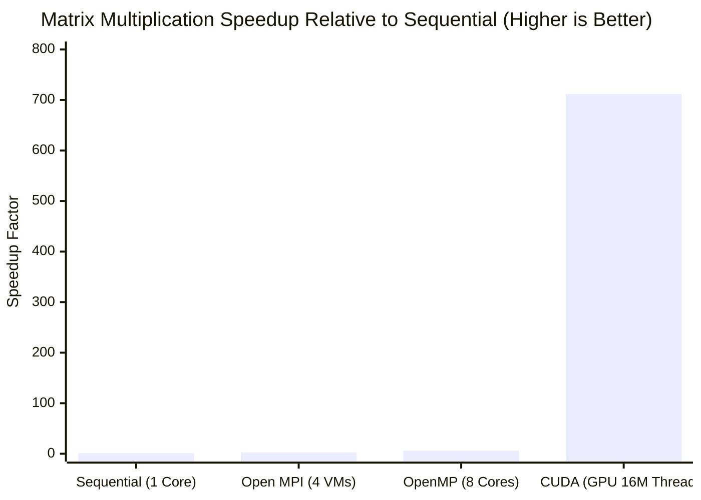
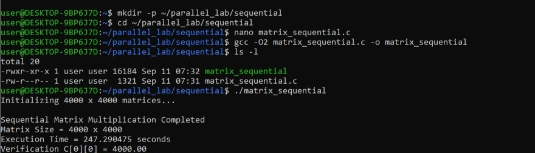
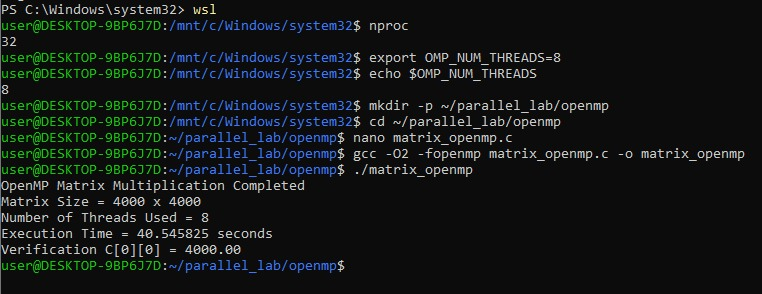
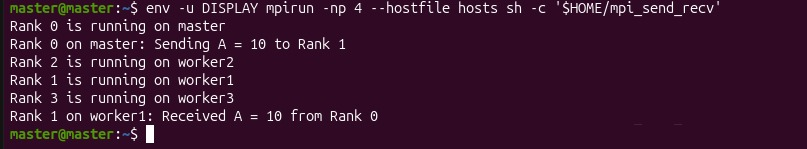
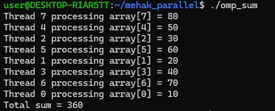
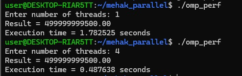

# Comparative Analysis of Sequential, OpenMP, MPI, CUDA, and Pthreads

> **A Practical Performance Benchmark of Parallel and GPU Computing Paradigms**  
> This repository provides an end-to-end performance comparison of modern parallel computing models—ranging from single-core CPU baselines to shared-memory multi-threading (OpenMP & Pthreads), distributed-memory clustering (Open MPI), and GPU acceleration (NVIDIA CUDA).

---

## 📌 Repository Organization at a Glance

The project is structured into two self-contained module directories:

| Module Directory | Primary Focus | Paradigms & Workloads | Key Artifacts |
| :--- | :--- | :--- | :--- |
| 📁 [**`Matrix_Multiplication/`**](./Matrix_Multiplication) | **Compute-Bound Throughput** | Sequential vs. OpenMP (8 Cores) vs. Open MPI (4 VMs) vs. CUDA (16M Threads) on **$4000 \times 4000$ Matrix Multiplication** (128 GFLOPs) | 4 C/CUDA source files, 4 detailed reports, and 24 authentic terminal/cluster screenshots |
| 📁 [**`Pthreads_and_OpenMP/`**](./Pthreads_and_OpenMP) | **Shared-Memory Concurrency & Scalability** | Thread teams, Race Conditions (75% data loss), Critical Sections, Barriers, and Scaling (1 to 16 threads) on **$10^6$ Element Summation** | 8 C source files, dedicated technical manual, and 10 authentic benchmark screenshots |

---

## 📊 Master Benchmark Summary

All implementations were verified against strict mathematical invariants:
- **Matrix Multiplication**: $C[0][0] = 4000.00$ (Deterministic correctness across all 4 implementations)
- **Numerical Summation**: $\text{Result} = 499999999500.00$ (Exact across Sequential, Pthreads, and OpenMP)

### Performance Benchmark Table:

| Study | Paradigm | Hardware / Configuration | Execution Time | Speedup | Efficiency | Mathematical Verification |
| :--- | :--- | :--- | :--- | :--- | :--- | :--- |
| **Matrix Multiplication** | **Sequential CPU** | 1 Core (Single-Threaded Baseline) | **244.12 s** | **1.00×** | 100.0% (Ref) | `C[0][0] = 4000.00` (PASS) |
| **Matrix Multiplication** | **Open MPI** | 4 Distributed Virtual Machines | **92.98 s** | **2.63×** | 65.8% | `C[0][0] = 4000.00` (PASS) |
| **Matrix Multiplication** | **OpenMP** | 8 vCPU Cores (Shared Memory) | **40.55 s** | **6.02×** | **75.3%** | `C[0][0] = 4000.00` (PASS) |
| **Matrix Multiplication** | **NVIDIA CUDA** | 16,000,000 GPU Threads (Total PCIe Phase) | **0.34 s** | **711.66×** | — | `C[0][0] = 4000.00` (PASS) |
| **Numerical Summation** | **Sequential Baseline** | 1 Core | **1.78 s** | **1.00×** | 100.0% (Ref) | `499999999500.00` (PASS) |
| **Numerical Summation** | **Pthreads** | 2 Threads | **0.89 s** | **1.99×** | **99.5%** | `499999999500.00` (PASS) |
| **Numerical Summation** | **OpenMP** | 4 Threads | **0.49 s** | **3.66×** | **91.5%** | `499999999500.00` (PASS) |
| **Numerical Summation** | **Pthreads** | 6 Threads | **0.35 s** | **5.16×** | **86.0%** | `499999999500.00` (PASS) |
| **Numerical Summation** | **Pthreads** | 16 Threads | **0.22 s** | **8.25×** | **51.6%** | `499999999500.00` (PASS) |

---

### Visual Speedup Comparison (Matrix Multiplication):



```text
Execution Time Comparison (Lower is Better):
Sequential (1 Core)  : [████████████████████████████████████████] 244.12 s (1.00x)
Open MPI (4 VMs)     : [███████████████                        ]  92.98 s (2.63x)
OpenMP (8 Cores)     : [██████                                ]  40.55 s (6.02x)
NVIDIA CUDA (GPU)    : [▏                                     ]   0.34 s (711.66x)
```

---

## 🚀 Part 1: Dense Matrix Multiplication Benchmarking

This study computes dense matrix multiplication $C = A \times B$ for $N = 4000$ ($16\text{ million}$ elements, $128\text{ GFLOPs}$).

### 1. Sequential CPU Baseline
- **How It Works**: Standard three nested loops running on a single CPU thread.
- **Source File**: [`Matrix_Multiplication/matrix_sequential.c`](./Matrix_Multiplication/matrix_sequential.c) | [Detailed Analysis](./Matrix_Multiplication/Sequential.md)
- **Run Command**:
  ```bash
  gcc -O2 Matrix_Multiplication/matrix_sequential.c -o matrix_sequential && ./matrix_sequential
  ```
- **Terminal Output**:
  
- **Key Takeaway**: Runtime was **`244.12 seconds`**. The single-core CPU suffers from continuous cache misses when traversing Matrix $B$ in column order, as each step jumps $32\text{ KB}$ across RAM, evicting 64-byte L1/L2 cache lines.

---

### 2. OpenMP Multi-Threading (Shared Memory)
- **How It Works**: Parallelizes the outer loop across 8 CPU threads using `#pragma omp parallel for private(j, k) schedule(static)`.
- **Source File**: [`Matrix_Multiplication/matrix_openmp.c`](./Matrix_Multiplication/matrix_openmp.c) | [Detailed Analysis](./Matrix_Multiplication/OpenMP.md)
- **Run Command**:
  ```bash
  export OMP_NUM_THREADS=8
  gcc -O2 -fopenmp Matrix_Multiplication/matrix_openmp.c -o matrix_openmp && ./matrix_openmp
  ```
- **Terminal Output**:
  
- **Key Takeaway**: Runtime dropped to **`40.55 seconds`** (**$6.02\times$ speedup, $75.3\%$ efficiency**). OpenMP threads share a unified physical address space and read Matrix $B$ simultaneously from shared L3 cache with zero network or copy latency.

---

### 3. Open MPI Distributed Cluster (4 Virtual Machines)
- **How It Works**: Distributes rows across 4 independent VM nodes (1 Master at `192.168.190.128`, 3 Workers) via SSH using `MPI_Scatter`, `MPI_Bcast`, and `MPI_Gather`.
- **Source File**: [`Matrix_Multiplication/matrix_mpi.c`](./Matrix_Multiplication/matrix_mpi.c) | [Detailed Cluster Setup & 21 Screenshots](./Matrix_Multiplication/MPI.md)
- **Run Command**:
  ```bash
  mpicc -O2 Matrix_Multiplication/matrix_mpi.c -o matrix_mpi
  mpirun -np 4 --hostfile hosts ./matrix_mpi
  ```
- **Terminal Output**:
  
- **Key Takeaway**: Runtime was **`92.98 seconds`** (**$2.63\times$ speedup**). While slower than shared-memory OpenMP due to network transmission over virtual Ethernet bridges (broadcasting the $128\text{ MB}$ matrix), Open MPI is not constrained by a single motherboard's RAM and can scale horizontally across thousands of nodes in cloud clusters.

---

### 4. NVIDIA CUDA GPU Acceleration
- **How It Works**: Offloads computation to the GPU using a 2D grid of thread blocks ($250 \times 250$ blocks, $16 \times 16$ threads = **16,000,000 active concurrent threads**).
- **Source File**: [`Matrix_Multiplication/matrix_cuda.cu`](./Matrix_Multiplication/matrix_cuda.cu) | [Detailed Analysis](./Matrix_Multiplication/CUDA.md)
- **Run Command**:
  ```bash
  nvcc -O2 Matrix_Multiplication/matrix_cuda.cu -o matrix_cuda.exe && ./matrix_cuda.exe
  ```
- **Terminal Output**:
  
- **Key Takeaway**: Total execution completed in **`0.34 seconds`** (**$711.66\times$ overall speedup**), with the kernel computing in just **`0.316872 seconds`** (**$770.40\times$ speedup**). The GPU's hardware warp scheduler manages thousands of threads concurrently, instantly switching between warps to completely hide memory latency.

---

## ⚙️ Part 2: Shared-Memory Concurrency, Synchronization & Scalability

This study investigates low-level concurrency control, the mechanics of race conditions, mutual exclusion, barriers, and multi-thread scalability across **Pthreads** and **OpenMP**.

### 1. Spawning Thread Teams & Querying IDs (`omp1.c`)
- Spawns 16 concurrent threads using `#pragma omp parallel num_threads(16)` and queries `omp_get_thread_num()`.
- **Output**:
  
- **Insight**: Threads execute and finish in non-deterministic order (e.g. 14, 13, 6, 8, 15...) based on CPU OS scheduling. Each thread maintains its own private stack frame for thread-safe local variables.

---

### 2. Work-Sharing Loop Reduction (`omp_sum.c`)
- Distributes an 8-element array across threads and computes the sum using `#pragma omp parallel for reduction(+:total_sum)`.
- **Output**:
  
- **Insight**: Instead of using heavy mutex locks on every addition, the `reduction` clause gives each thread a private accumulator and combines them using a lock-free hardware tree, yielding the exact mathematical total of **360**.

---

### 3. The Concurrency Bug: Race Condition Hazard (`omp_race.c`)
- Four threads concurrently increment a shared `counter` 100,000 times each without synchronization. Expected result: $4 \times 100,000 = \mathbf{400,000}$.
- **Output**:
  
- **Insight**: The actual counter recorded only **`100,182`**—a loss of **299,818 updates (74.95% data corruption)**! Because `counter++` compiles into three CPU instructions (`MOV`, `ADD`, `MOV`), concurrent threads overwrite each other's register updates.

---

### 4. The Solution: Mutual Exclusion via Critical Section (`omp_critical.c`)
- Wraps the increment inside `#pragma omp critical`.
- **Output**:
  
- **Insight**: Expected: **400,000**, Actual: **400,000** (**zero data loss**). Mutual exclusion ensures only one thread can execute the increment at any instant, completely preventing race conditions.

---

### 5. Phased Synchronization: Barrier (`omp_barrier.c`)
- Coordinates threads across a two-stage computation using `#pragma omp barrier`.
- **Output**:
  
- **Insight**: Guarantees that all 4 threads complete **Stage 1** before ANY thread is permitted to begin **Stage 2**. Early-arriving threads wait at the barrier, essential for multi-step iterative algorithms.

---

### 6. Scalability Benchmark: Sequential vs. Pthreads vs. OpenMP
Evaluates multi-threaded scaling on a $1,000,000$ element summation (Target Invariant: `499999999500.00`):

- **Sequential Baseline**: **`1.78 s`** ($1.00\times$)
  
- **Pthreads (1 & 2 Threads)**: 1T = `1.78 s`, 2T = **`0.89 s`** (**$1.99\times$ speedup, $99.5\%$ efficiency**)
  
- **Pthreads (6 Threads)**: **`0.35 s`** (**$5.16\times$ speedup, $86.0\%$ efficiency**)
  
- **Pthreads (16 Threads)**: **`0.22 s`** (**$8.25\times$ speedup, $51.6\%$ efficiency**)
  
- **OpenMP (1 & 4 Threads)**: 1T = `1.78 s`, 4T = **`0.49 s`** (**$3.66\times$ speedup, $91.5\%$ efficiency**)
  

---

## 🎯 Architecture Decision Guide: Which Paradigm to Use?

| Requirement / Scenario | Recommended Paradigm | Key Reason |
| :--- | :--- | :--- |
| **Massive data parallelism & tensor math** | **NVIDIA CUDA** | Up to **700×+ speedup** utilizing thousands of GPU cores. |
| **Fast multi-core CPU speedup on loops** | **OpenMP** | Add simple `#pragma omp` directives with minimal code changes (**75%–91% efficiency**). |
| **Low-level thread lifecycle control** | **POSIX Threads (Pthreads)** | Direct control over thread priority, affinity, and custom thread pools. |
| **Datacenter & multi-node clusters** | **Open MPI** | Scales across multiple physical machines without single-motherboard RAM limits. |
| **Modern High-Performance Production** | **Hybrid (MPI + OpenMP + CUDA)** | Distribute across nodes with MPI, share multi-core CPUs with OpenMP, and accelerate kernels with CUDA. |

---

## 💻 Quick-Start Reproduction Guide

### Run Matrix Multiplication Benchmarks:
```bash
cd Matrix_Multiplication

# 1. Sequential CPU Baseline
gcc -O2 matrix_sequential.c -o matrix_sequential && ./matrix_sequential

# 2. OpenMP (8 Threads)
export OMP_NUM_THREADS=8 && gcc -O2 -fopenmp matrix_openmp.c -o matrix_openmp && ./matrix_openmp

# 3. Open MPI (4 Nodes)
mpicc -O2 matrix_mpi.c -o matrix_mpi && mpirun -np 4 ./matrix_mpi

# 4. NVIDIA CUDA (GPU)
nvcc -O2 matrix_cuda.cu -o matrix_cuda.exe && ./matrix_cuda.exe
```

### Run Concurrency & Scalability Programs:
```bash
cd Pthreads_and_OpenMP

# Thread Team Querying
gcc -fopenmp omp1.c -o omp1 && ./omp1

# Parallel Reduction Sum
gcc -fopenmp omp_sum.c -o omp_sum && ./omp_sum

# Race Condition Demonstration
gcc -fopenmp omp_race.c -o omp_race && ./omp_race

# Critical Section Fix
gcc -fopenmp omp_critical.c -o omp_critical && ./omp_critical

# Phased Barrier Synchronization
gcc -fopenmp omp_barrier.c -o omp_barrier && ./omp_barrier

# Pthreads Scalability Benchmark (Enter 1, 2, 6, 16)
gcc -O2 -pthread pthread_perf.c -o pthread_perf && ./pthread_perf

# OpenMP Scalability Benchmark (Enter 1, 4)
gcc -O2 -fopenmp omp_perf.c -o omp_perf && ./omp_perf
```

---

## 📁 Repository Structure

```text
Parallel-and-GPU-Computing/
│
├── README.md                   # Master combined comparative analysis & executive report
├── .gitignore                  # Ignores compiled binaries, objects, and temp files
│
├── Matrix_Multiplication/      # Module 1: Dense Matrix Multiplication (4000 x 4000)
│   ├── README.md               # Dedicated matrix multiplication technical report
│   ├── Sequential.md           # Sequential CPU baseline analysis
│   ├── OpenMP.md               # OpenMP multi-threading analysis
│   ├── MPI.md                  # Open MPI 4-node cluster report (21 setup screenshots)
│   ├── CUDA.md                 # NVIDIA CUDA GPU acceleration report
│   ├── matrix_sequential.c     # Standalone C source for sequential baseline
│   ├── matrix_openmp.c         # Standalone C source for OpenMP parallel loops
│   ├── matrix_mpi.c            # Standalone C source for MPI distributed cluster
│   ├── matrix_cuda.cu          # Standalone CUDA source for GPU kernel & host DMA
│   └── images/                 # All 24 authentic output screenshots & cluster deployment logs
│       ├── sequential_olp.png
│       ├── openmp_olp.png
│       ├── cuda_olp.jpeg
│       └── 01_ping_connectivity.jpeg ... 21_mpi_send_recv_output.jpeg
│
└── Pthreads_and_OpenMP/        # Module 2: Shared-Memory Concurrency & Synchronization
    ├── README.md               # Dedicated Pthreads & OpenMP technical manual
    ├── omp1.c                  # Thread team creation & ID querying
    ├── omp_sum.c               # Work-sharing loop reduction
    ├── omp_race.c              # Race condition demonstration (75% data loss)
    ├── omp_critical.c          # Mutual exclusion via critical section
    ├── omp_barrier.c           # Phased barrier synchronization
    ├── sequential.c            # Single-threaded summation baseline
    ├── pthread_perf.c          # Pthreads scalability benchmark (1, 2, 6, 16 threads)
    ├── omp_perf.c              # OpenMP scalability benchmark (1, 4 threads)
    └── images/                 # 10 authentic terminal output screenshots
        ├── 01_omp_hello_16threads.jpeg
        ├── 02_omp_sum_reduction.jpeg
        ├── 03_omp_race_condition.jpeg
        ├── 04_omp_critical_section.jpeg
        ├── 05_omp_barrier_sync.jpeg
        ├── 06_sequential_baseline.jpeg
        ├── 07_pthread_1_and_2_threads.jpeg
        ├── 08_pthread_6_threads.jpeg
        ├── 09_pthread_16_threads.jpeg
        └── 10_omp_1_and_4_threads.jpeg
```
