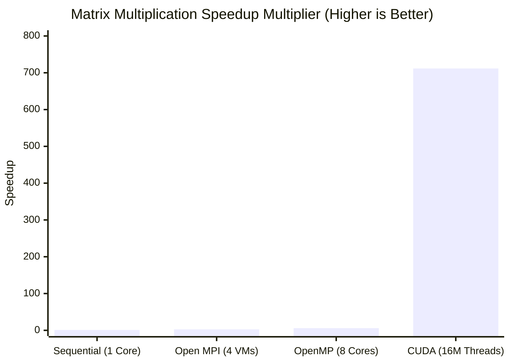
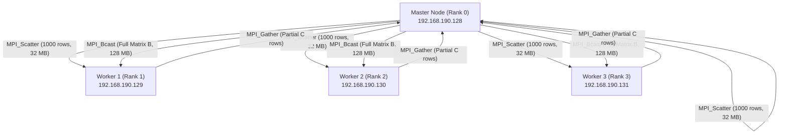
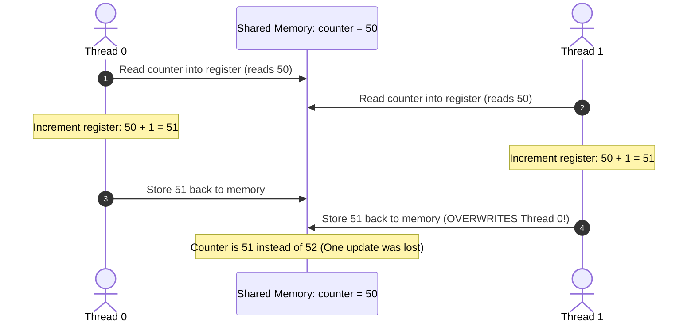
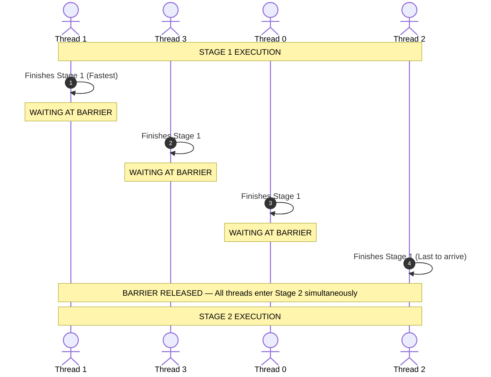
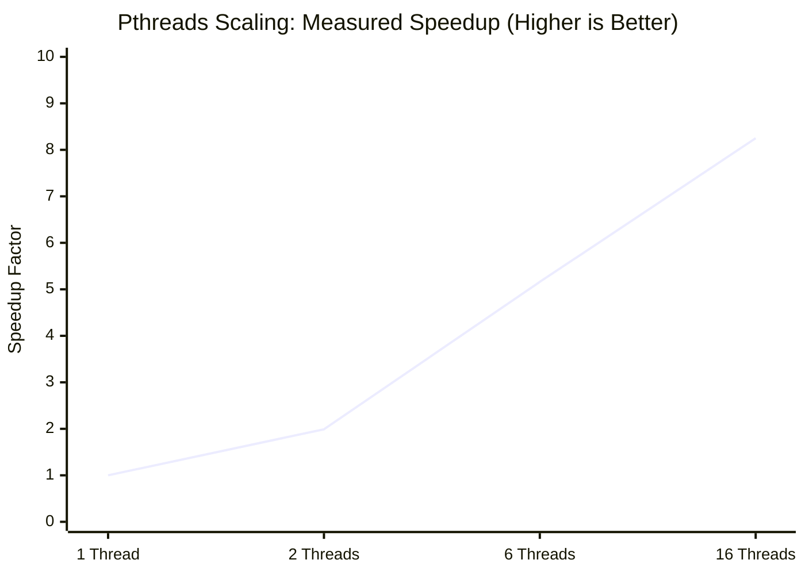

# Comparative Analysis: Sequential, OpenMP, MPI, CUDA, and Pthreads

This repository contains performance benchmarks and implementations across parallel and distributed computing paradigms, organized into two core experiments:

1. **Dense Matrix Multiplication ($4000 \times 4000$)**: Evaluates compute throughput across Sequential CPU, OpenMP (8 cores), Open MPI (4-node virtual cluster), and NVIDIA CUDA (16 million GPU threads).
2. **Concurrency, Synchronization & Scalability**: Analyzes multi-threaded shared-memory programming, race conditions (losing ~75% of updates), mutual exclusion, barrier synchronization, and scaling benchmarks on POSIX Threads (Pthreads: 1–16 threads) and OpenMP.

---

## Repository Layout

All code and standalone technical reports are organized into two dedicated folders:

| Directory | Topic | Included Implementations | Contents |
| :--- | :--- | :--- | :--- |
| [**`Matrix_Multiplication/`**](./Matrix_Multiplication) | Compute-bound matrix multiplication | Sequential C, OpenMP C, Open MPI C, CUDA C++ | 4 source codes, 4 detailed reports, and 24 terminal/cluster screenshots |
| [**`Pthreads_and_OpenMP/`**](./Pthreads_and_OpenMP) | Concurrency control & thread scaling | Pthreads C, OpenMP C, Sequential C | 8 source codes, concurrency manual, and 10 output screenshots |

---

## Summary of Results

All benchmark runs were mathematically validated:
- **Matrix Multiplication**: $C[0][0] = 4000.00$ (Matches across Sequential, OpenMP, MPI, and CUDA).
- **Numerical Summation**: $\text{Result} = 499999999500.00$ (Matches across Sequential, Pthreads, and OpenMP).

| Benchmark | Paradigm | Hardware / Configuration | Execution Time | Speedup | Parallel Efficiency | Correctness |
| :--- | :--- | :--- | :--- | :--- | :--- | :--- |
| **Matrix Multiplication** | **Sequential CPU** | 1 Core (Single-Threaded) | **244.12 s** | **1.00×** (Ref) | 100.0% | `4000.00` (PASS) |
| **Matrix Multiplication** | **Open MPI** | 4 VM Cluster Nodes | **92.98 s** | **2.63×** | 65.8% | `4000.00` (PASS) |
| **Matrix Multiplication** | **OpenMP** | 8 vCPU Cores | **40.55 s** | **6.02×** | **75.3%** | `4000.00` (PASS) |
| **Matrix Multiplication** | **NVIDIA CUDA** | 16M GPU Threads (Total PCIe) | **0.34 s** | **711.66×** | — | `4000.00` (PASS) |
| **Numerical Summation** | **Sequential CPU** | 1 Core (Baseline) | **1.78 s** | **1.00×** (Ref) | 100.0% | `PASS` |
| **Numerical Summation** | **Pthreads** | 2 Threads | **0.89 s** | **1.99×** | **99.5%** | `PASS` |
| **Numerical Summation** | **OpenMP** | 4 Threads | **0.49 s** | **3.66×** | **91.5%** | `PASS` |
| **Numerical Summation** | **Pthreads** | 6 Threads | **0.35 s** | **5.16×** | **86.0%** | `PASS` |
| **Numerical Summation** | **Pthreads** | 16 Threads | **0.22 s** | **8.25×** | **51.6%** | `PASS` |

---

## Part 1: Dense Matrix Multiplication (4000 x 4000)

Each implementation multiplies two $4000 \times 4000$ double/float matrices, performing $2 \times (4000)^3 = 128 \text{ GFLOPs}$.

### Visual Performance Comparison



```text
Execution Time Comparison (Lower is Better):
Sequential (1 Core)  : [████████████████████████████████████████] 244.12 s (1.00x Baseline)
Open MPI (4 VMs)     : [███████████████                        ]  92.98 s (2.63x Speedup)
OpenMP (8 Cores)     : [██████                                ]  40.55 s (6.02x Speedup)
NVIDIA CUDA (GPU)    : [▏                                     ]   0.34 s (711.66x Speedup)
```

---

### 1. Sequential CPU Baseline
- **Description**: Standard $O(N^3)$ nested loops on a single CPU thread.
- **Source**: [`Matrix_Multiplication/matrix_sequential.c`](./Matrix_Multiplication/matrix_sequential.c) | [Detailed Analysis](./Matrix_Multiplication/Sequential.md)
- **Compile & Run**:
  ```bash
  gcc -O2 Matrix_Multiplication/matrix_sequential.c -o matrix_sequential && ./matrix_sequential
  ```
- **Output**:
  
- **Why it is slow**: In row-major layout, accessing Matrix $B$ (`B[k * N + j]`) jumps $32\text{ KB}$ across RAM every step, causing continuous cache line evictions and memory bus stalls ($244.12\text{ s}$).

---

### 2. OpenMP Multi-Threading (Shared Memory)
- **Description**: Parallelizes outer rows across 8 CPU threads using `#pragma omp parallel for`.
- **Source**: [`Matrix_Multiplication/matrix_openmp.c`](./Matrix_Multiplication/matrix_openmp.c) | [Detailed Analysis](./Matrix_Multiplication/OpenMP.md)
- **Compile & Run**:
  ```bash
  export OMP_NUM_THREADS=8
  gcc -O2 -fopenmp Matrix_Multiplication/matrix_openmp.c -o matrix_openmp && ./matrix_openmp
  ```
- **Output**:
  
- **Why it scales well**: OpenMP threads share the same physical RAM. All 8 cores access Matrix $B$ through shared on-chip L3 cache with zero copy overhead, achieving **$6.02\times$ speedup** and **$75.3\%$ efficiency** ($40.55\text{ s}$).

---

### 3. Open MPI Distributed Cluster (4 Nodes)
- **Description**: Distributes rows across 4 independent virtual machines over a local network using `MPI_Scatter`, `MPI_Bcast`, and `MPI_Gather`.
- **Source**: [`Matrix_Multiplication/matrix_mpi.c`](./Matrix_Multiplication/matrix_mpi.c) | [Cluster Setup Guide & 21 Screenshots](./Matrix_Multiplication/MPI.md)
- **Compile & Run**:
  ```bash
  mpicc -O2 Matrix_Multiplication/matrix_mpi.c -o matrix_mpi
  mpirun -np 4 --hostfile hosts ./matrix_mpi
  ```
- **Output**:
  

#### Cluster Network Topology & Data Distribution Flow

- **Why network limits speedup**: Broadcasting the $128\text{ MB}$ Matrix $B$ over virtual Ethernet bridges adds serialization latency. Despite network overhead, it achieved a **$2.63\times$ speedup** ($92.98\text{ s}$) and can scale across multiple physical machines without motherboard RAM limits.

---

### 4. NVIDIA CUDA GPU Acceleration
- **Description**: Offloads computation to an NVIDIA GPU using a 2D grid ($250 \times 250$ blocks, $16 \times 16$ threads = **16,000,000 active threads**), computing each cell concurrently.
- **Source**: [`Matrix_Multiplication/matrix_cuda.cu`](./Matrix_Multiplication/matrix_cuda.cu) | [Detailed Analysis](./Matrix_Multiplication/CUDA.md)
- **Compile & Run**:
  ```bash
  nvcc -O2 Matrix_Multiplication/matrix_cuda.cu -o matrix_cuda.exe && ./matrix_cuda.exe
  ```
- **Output**:
  
- **Why it is dramatically faster**: The GPU executes computation across streaming multiprocessors in warps of 32 threads. When one warp stalls on memory, another warp executes immediately, achieving near 100% compute utilization and finishing in **`0.34 seconds`** (**$711.66\times$ speedup**).

---

## Part 2: Concurrency, Synchronization & Thread Scaling

This study evaluates multi-threaded shared-memory programming, low-level concurrency bugs, synchronization primitives, and scaling behavior across **POSIX Threads (Pthreads)** and **OpenMP**.

---

### 1. Spawning Threads (`omp1.c`)
Spawns 16 threads using `#pragma omp parallel num_threads(16)` and prints thread rank and team size.


- **Behavior**: Threads complete asynchronously in non-deterministic order (e.g. Thread 14 finishes first, followed by 13, 6, 8...). The OS kernel schedules threads across cores independently.

---

### 2. Work-Sharing Reduction (`omp_sum.c`)
Calculates the sum of an 8-element array using `#pragma omp parallel for reduction(+:total_sum)`.


- **Behavior**: Instead of acquiring expensive mutex locks on every addition, the `reduction` clause gives each thread a private accumulator and sums them into `total_sum = 360` at loop completion.

---

### 3. The Concurrency Hazard: Race Condition (`omp_race.c`)
Four threads concurrently increment a shared `counter` 100,000 times each without synchronization. Expected result: $4 \times 100,000 = \mathbf{400,000}$.


#### Visual Mechanics of the Race Condition:


- **Observed Result**: The actual counter recorded only **`100,182`**. A total of **299,818 increments were lost (74.95% data corruption)** because `counter++` is not atomic (`MOV`, `ADD`, `MOV`).

---

### 4. The Fix: Mutual Exclusion via Critical Section (`omp_critical.c`)
Protects the shared increment using `#pragma omp critical`.


- **Observed Result**: Expected: **`400,000`**, Actual: **`400,000`** (**zero lost updates**). Mutual exclusion ensures only one thread can modify the memory address at any given moment.

---

### 5. Phased Synchronization: Barrier (`omp_barrier.c`)
Coordinates threads across a two-stage computation using `#pragma omp barrier`.


#### Visual Flow of Barrier Synchronization:


- **Behavior**: All 4 threads finish Stage 1 before ANY thread begins Stage 2. Faster threads block at the barrier until the slowest thread arrives, essential in iterative algorithms.

---

### 6. Scalability Benchmarks: Pthreads vs. OpenMP

Evaluates scaling across different thread counts on a $1,000,000$ element summation (Result invariant: `499999999500.00`).

#### Pthreads Scalability Curve (Speedup vs. Threads):



```text
Pthreads Execution Time Scaling (Lower is Better):
1 Thread   : [████████████████████████████████████████] 1.78 s (1.00x Baseline)
2 Threads  : [████████████████████                    ] 0.89 s (1.99x - 99.5% Efficiency)
6 Threads  : [████████                                ] 0.35 s (5.16x - 86.0% Efficiency)
16 Threads : [█████                                   ] 0.22 s (8.25x - 51.6% Efficiency)
```

#### Terminal Outputs:
- **Sequential Baseline** (`1.78 s`):
  
- **Pthreads 1 & 2 Threads** (2T: `0.89 s`, **$1.99\times$ speedup, $99.5\%$ efficiency**):
  
- **Pthreads 6 Threads** (`0.35 s`, **$5.16\times$ speedup, $86.0\%$ efficiency**):
  
- **Pthreads 16 Threads** (`0.22 s`, **$8.25\times$ speedup, $51.6\%$ efficiency**):
  
- **OpenMP 1 & 4 Threads** (4T: `0.49 s`, **$3.66\times$ speedup, $91.5\%$ efficiency**):
  

- **Analysis**: Pthreads achieves near-perfect linear scaling on 2 threads ($99.5\%$ efficiency). At 16 threads, efficiency drops to $51.6\%$ due to CPU hyper-threading resource sharing (logical cores sharing pipelines) and memory bus saturation.

---

## Architectural Comparison & Trade-Offs

| Paradigm | Target Architecture | Concurrency Scale | Memory Access | Communication Mechanism | Best Used For |
| :--- | :--- | :--- | :--- | :--- | :--- |
| **Sequential** | 1 CPU Core | 1 Thread | Local RAM / Cache | None | Baseline testing & small workloads |
| **OpenMP** | Multi-core CPU Socket | 8–16 Threads | Unified Shared Memory | Shared heap, `#pragma` directives | Parallelizing loops with minimal code changes |
| **Pthreads** | Multi-core CPU Socket | 2–64 Threads | Unified Shared Memory | Explicit mutexes & thread structs | Fine-grained thread lifecycle and pool control |
| **Open MPI** | Multi-node Cluster | 4–1000s Nodes | Distributed Private RAM | Network messages (`Scatter`, `Bcast`) | Workloads exceeding single-node RAM capacity |
| **NVIDIA CUDA** | GPU SMs | 16,000,000 Threads | Dedicated High-Bandwidth VRAM | PCIe DMA (`cudaMemcpy`) | Dense linear algebra and tensor math |

---

## How to Compile & Run

### Matrix Multiplication:
```bash
cd Matrix_Multiplication

# Sequential
gcc -O2 matrix_sequential.c -o matrix_sequential && ./matrix_sequential

# OpenMP (8 threads)
export OMP_NUM_THREADS=8 && gcc -O2 -fopenmp matrix_openmp.c -o matrix_openmp && ./matrix_openmp

# Open MPI (4 processes)
mpicc -O2 matrix_mpi.c -o matrix_mpi && mpirun -np 4 ./matrix_mpi

# CUDA (NVIDIA GPU)
nvcc -O2 matrix_cuda.cu -o matrix_cuda.exe && ./matrix_cuda.exe
```

### Concurrency & Thread Scaling:
```bash
cd Pthreads_and_OpenMP

# Part A: Foundational Pthreads Programs
gcc thread1.c -o thread1 -pthread && ./thread1
gcc thread2.c -o thread2 -pthread && ./thread2
gcc thread_sum.c -o thread_sum -pthread && ./thread_sum
gcc race.c -o race -pthread && ./race
gcc mutex.c -o mutex -pthread && ./mutex

# Part B: OpenMP Concurrency Programs
gcc -fopenmp omp1.c -o omp1 && ./omp1

# 2. Reduction Sum
gcc -fopenmp omp_sum.c -o omp_sum && ./omp_sum

# 3. Race Condition Bug
gcc -fopenmp omp_race.c -o omp_race && ./omp_race

# 4. Critical Section Fix
gcc -fopenmp omp_critical.c -o omp_critical && ./omp_critical

# 5. Barrier Synchronization
gcc -fopenmp omp_barrier.c -o omp_barrier && ./omp_barrier

# 6. Pthreads Scalability (Enter 1, 2, 6, 16)
gcc -O2 -pthread pthread_perf.c -o pthread_perf && ./pthread_perf

# 7. OpenMP Scalability (Enter 1, 4)
gcc -O2 -fopenmp omp_perf.c -o omp_perf && ./omp_perf
```

---

## Repository Tree

```text
Parallel-and-GPU-Computing/
│
├── README.md                   # Master benchmark report & comparative analysis
├── .gitignore                  # Ignores compiled binaries, objects, and temp files
│
├── Matrix_Multiplication/      # Module 1: Dense Matrix Multiplication (4000 x 4000)
│   ├── README.md               # Dedicated matrix multiplication technical report
│   ├── Sequential.md           # Sequential CPU baseline analysis
│   ├── OpenMP.md               # OpenMP multi-threading analysis
│   ├── MPI.md                  # Open MPI 4-node cluster report (21 setup screenshots)
│   ├── CUDA.md                 # NVIDIA CUDA GPU acceleration report
│   ├── matrix_sequential.c     # Standalone C source for sequential baseline
│   ├── matrix_openmp.c         # Standalone C source for OpenMP parallel loops
│   ├── matrix_mpi.c            # Standalone C source for MPI distributed cluster
│   ├── matrix_cuda.cu          # Standalone CUDA source for GPU kernel & host DMA
│   └── images/                 # All 24 authentic output screenshots & cluster deployment logs
│       ├── sequential_olp.png
│       ├── openmp_olp.png
│       ├── cuda_olp.jpeg
│       └── 01_ping_connectivity.jpeg ... 21_mpi_send_recv_output.jpeg
│
└── Pthreads_and_OpenMP/        # Module 2: Shared-Memory Concurrency & Synchronization
    ├── README.md               # Dedicated Pthreads & OpenMP technical laboratory manual
    ├── thread1.c               # Step 1: Single thread creation and joining
    ├── thread2.c               # Step 2: Spawning multiple threads (4 threads)
    ├── thread_sum.c            # Step 3: Array chunk partitioning and partial sums
    ├── race.c                  # Step 4: Pthreads race condition demonstration
    ├── mutex.c                 # Step 5: Fixing race condition with pthread_mutex
    ├── omp1.c                  # Step 6: OpenMP parallel region and thread IDs
    ├── omp_sum.c               # Step 7: OpenMP work-sharing loop and reduction
    ├── omp_race.c              # Step 8: OpenMP race condition demonstration
    ├── omp_critical.c          # Step 9: OpenMP critical section mutual exclusion
    ├── omp_barrier.c           # Step 10: OpenMP phased barrier coordination
    ├── sequential.c            # Step 11: Single-threaded summation baseline (N=10^9)
    ├── pthread_perf.c          # Step 12: Pthreads scalability benchmark (1 to 16 threads)
    ├── omp_perf.c              # Step 14: OpenMP scalability benchmark (1 to 16 threads)
    └── images/                 # All 10 authentic execution output screenshots
        ├── 01_omp_hello_16threads.jpeg
        ├── 02_omp_sum_reduction.jpeg
        ├── 03_omp_race_condition.jpeg
        ├── 04_omp_critical_section.jpeg
        ├── 05_omp_barrier_sync.jpeg
        ├── 06_sequential_baseline.jpeg
        ├── 07_pthread_1_and_2_threads.jpeg
        ├── 08_pthread_6_threads.jpeg
        ├── 09_pthread_16_threads.jpeg
        └── 10_omp_1_and_4_threads.jpeg
```
