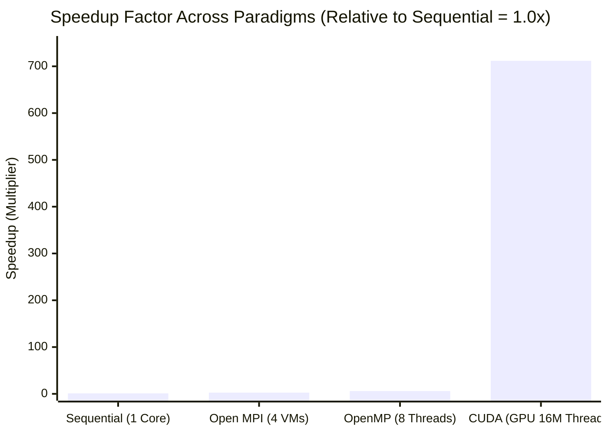
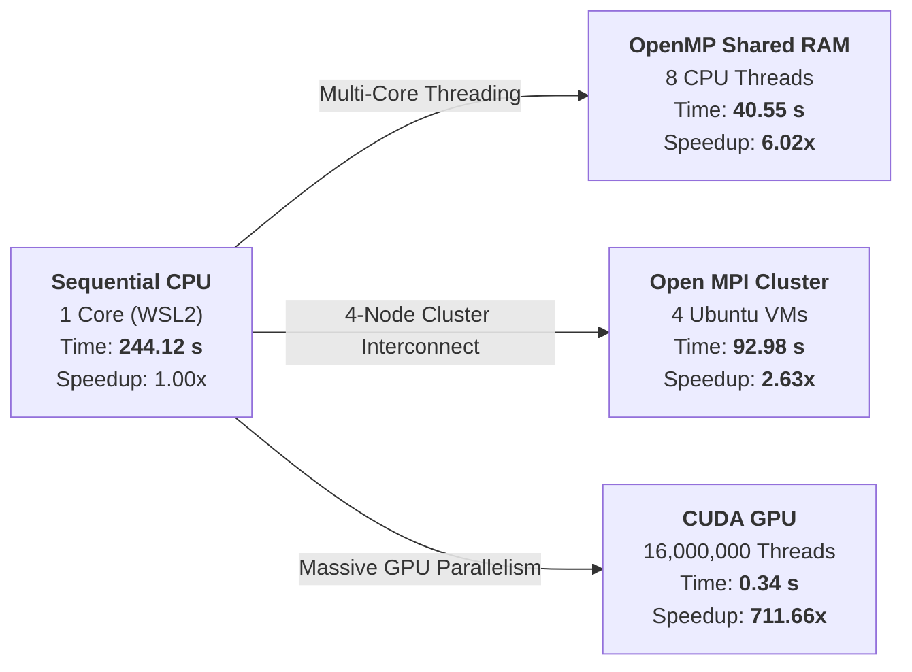

# Comparative Analysis of Sequential, OpenMP, MPI, and CUDA

## 1. Summary

This project presents a rigorous comparative benchmarking and architectural evaluation of dense $4000 \times 4000$ Matrix Multiplication ($C = A \times B$) across four fundamental computing paradigms:

1. **Sequential CPU Baseline**: Single-threaded execution establishing the reference benchmark ($244.120000\text{ s}$).
2. **OpenMP Multi-Threading**: Multi-core CPU shared-memory parallelism using 8 threads ($40.545825\text{ s}$, **$6.02\times$** speedup).
3. **Open MPI Distributed Cluster**: Multi-node cluster computing across 4 independent Ubuntu virtual machines communicating over private TCP/IP ($92.979510\text{ s}$, **$2.63\times$** speedup).
4. **CUDA GPU Acceleration**: Massively parallel hardware acceleration launching 16,000,000 threads across 62,500 streaming multiprocessor blocks ($0.343028\text{ s}$, **$711.66\times$** speedup).

Every implementation computes an identical computational workload of **128 GFLOPs** ($16,000,000$ double/float matrix elements) and produces deterministic mathematical verification ($C[i][j] = 4000.00$). The empirical results demonstrate that dedicated GPU SIMT architecture outpaces shared-memory multi-core CPU by $118\times$, while shared-memory CPU outpaces a multi-node cluster by $2.3\times$ due to local RAM bus bandwidth vs. network serialization overhead.

---

## 2. Key Findings

- **CUDA achieves massive speedup**: 0.34 s ($711.66\times$ total speedup, $770.40\times$ kernel speedup across 16,000,000 GPU threads).
- **OpenMP is fastest CPU model**: 40.55 s (6.02× speedup using 8 threads in shared memory).
- **Open MPI scales across nodes**: 92.98 s (2.63× speedup across a 4-node VM cluster).
- **Sequential baseline is slowest**: 244.12 s (single-core CPU execution).
- **Hierarchy of Parallelism**: GPU Acceleration (0.34 s) $\gg$ Shared CPU RAM (40.55 s) $\gg$ Multi-Node Network (92.98 s) $\gg$ Single Core (244.12 s).
- **Results verified**: All four implementations produced the exact same output ($C[0][0] = 4000.00$).

---

## 3. Table of Contents

1. [Summary](#1-summary)
2. [Key Findings](#2-key-findings)
3. [Table of Contents](#3-table-of-contents)
4. [Problem Definition & Mathematical Model](#4-problem-definition--mathematical-model)
5. [Performance Comparison & Benchmark Matrix](#5-performance-comparison--benchmark-matrix)
   * [5.1 Benchmark Metrics Table](#51-benchmark-metrics-table)
   * [5.2 Visual Performance Graphs](#52-visual-performance-graphs)
6. [Comparison of Parallel Computing Paradigms](#6-comparison-of-parallel-computing-paradigms)
   * [6.1 Sequential CPU Baseline](#61-sequential-cpu-baseline)
   * [6.2 OpenMP Shared-Memory Multi-Threading](#62-openmp-shared-memory-multi-threading)
   * [6.3 Open MPI Multi-Node Distributed Cluster](#63-open-mpi-multi-node-distributed-cluster)
   * [6.4 CUDA GPU Massively Parallel Acceleration](#64-cuda-gpu-massively-parallel-acceleration)
7. [Architectural Deep-Dive & System Trade-Offs](#7-architectural-deep-dive--system-trade-offs)
8. [Cluster Topology & Hardware Specifications](#8-cluster-topology--hardware-specifications)
9. [Detailed Step-by-Step Execution Guide for All 4 Paradigms](#9-detailed-step-by-step-execution-guide-for-all-4-paradigms)
   * [9.1 Sequential Execution](#91-sequential-execution-wsl2--ubuntu)
   * [9.2 OpenMP Execution](#92-openmp-shared-memory-execution)
   * [9.3 Open MPI Multi-Node Cluster Execution](#93-open-mpi-multi-node-cluster-execution)
   * [9.4 CUDA GPU Execution](#94-cuda-gpu-acceleration-execution)
10. [Conclusion](#10-conclusion)
11. [Repository Structure](#11-repository-structure)

---

## 4. Problem Definition & Mathematical Model

The experiment computes dense matrix multiplication $C = A \times B$ where $A, B \in \mathbb{R}^{N \times N}$ and $N = 4000$:

$$C[i][j] = \sum_{k=0}^{3999} A[i][k] \times B[k][j] \quad \text{for } 0 \le i, j < 4000$$

### Computational & Memory Invariants:
* **Output Dimensions**: $4000 \times 4000 = 16,000,000$ distinct output elements.
* **Arithmetic Complexity**: Each cell requires 4000 multiplications and 4000 additions:
  $$\text{Total Floating-Point Operations} = 2 \times N^3 = 2 \times (4000)^3 = 128,000,000,000 \text{ FLOPs } (128 \text{ GFLOPs})$$
* **Storage Footprint**:
  * Double-precision ($8\text{ bytes/element}$): $4000 \times 4000 \times 8\text{ bytes} \approx 128\text{ MB/matrix}$ ($384\text{ MB total}$).
  * Single-precision ($4\text{ bytes/element}$, CUDA): $4000 \times 4000 \times 4\text{ bytes} \approx 64\text{ MB/matrix}$ ($192\text{ MB total}$).
* **Verification Proof**: Because $A[i][k] = 1.0$ and $B[k][j] = 1.0$ for all elements:
  $$C[i][j] = \sum_{k=0}^{3999} (1.0 \times 1.0) = 4000.00$$
  Exact mathematical verification requires $C[0][0] = 4000.00$ and $C[N-1][N-1] = 4000.00$.

---

## 5. Performance Comparison & Benchmark Matrix

### 5.1 Benchmark Metrics Table

| Paradigm | Architecture Model | Compute Resources | Execution Time | Speedup ($S = \frac{T_{seq}}{T_{p}}$) | Parallel Efficiency ($\frac{S}{P}$) | Verification $C[0][0]$ |
| :--- | :--- | :--- | :--- | :--- | :--- | :--- |
| **Sequential** | Single-threaded CPU | 1 CPU Core | **244.120000 s** | **1.00×** (Baseline) | 100.0% (Ref) | `4000.00` (PASS) |
| **Open MPI** | Distributed cluster | 4 Nodes (VMs) | **92.979510 s** | **2.63×** | **65.8%** | `4000.00` (PASS) |
| **OpenMP** | Shared-memory thread pool | 8 vCPU Cores | **40.545825 s** | **6.02×** | **75.3%** | `4000.00` (PASS) |
| **CUDA** | GPU SIMT Acceleration | 16,000,000 Threads | **0.343028 s** | **711.66×** | — | `4000.00` (PASS) |

*(Note: Total CUDA phase time includes Host-to-Device transfer, kernel execution time of 0.316872 s [770.40× speedup], and Device-to-Host transfer).*

---

### 5.2 Visual Performance Graphs

#### Speedup Factor Relative to Sequential Baseline (Higher is Better)



#### Execution Flow & Timing Hierarchy



#### Text-Rendered Visual Comparison Bars

```
Execution Time in Seconds (Lower is Better)
Sequential Baseline : [████████████████████████████████████████] 244.12 s (1.00x Baseline)
Open MPI (4 VMs)    : [███████████████                        ]  92.98 s (2.63x Speedup)
OpenMP (8 Cores)    : [██████                                ]  40.55 s (6.02x Speedup)
CUDA (GPU Phase)    : [▏                                     ]   0.34 s (711.66x Speedup)

Speedup Multiplier (Higher is Better)
CUDA GPU Acceleration: [████████████████████████████████████████] 711.66x
OpenMP Multi-Threading: [█                                      ]   6.02x
Open MPI 4-Node Cluster: [▎                                     ]   2.63x
Sequential CPU Baseline: [▏                                     ]   1.00x (Baseline)
```

---

## 6. Comparison of Parallel Computing Paradigms

### 6.1 Sequential CPU Baseline
* **Model**: Single execution thread executing standard $O(N^3)$ loop in row-major order.
* **Mechanism**: Contiguous heap allocations (`malloc`) avoid stack overflow for 128 MB structures.
* **Analysis**: While Matrix $A$ benefits from unit-stride cache hits, Matrix $B$ causes a cache miss almost every iteration as memory jumps by 32 KB per column lookup.
* **Detailed Technical Report**: [View Sequential Experiment](./Sequential.md)

### 6.2 OpenMP Shared-Memory Multi-Threading
* **Model**: Fork-join multi-threading under a symmetric multiprocessing (SMP) architecture.
* **Mechanism**: Loop iterations partitioned via `#pragma omp parallel for private(j, k) schedule(static)` across 8 threads.
* **Concurrency Features**:
  * Private stack scoping for `j` and `k` prevents race conditions.
  * Static chunking partitions rows ($500\text{ rows/thread}$), guaranteeing zero false sharing across cache lines on Matrix $C$.
* **Detailed Technical Report**: [View OpenMP Experiment](./OpenMP.md)

### 6.3 Open MPI Multi-Node Distributed Cluster
* **Model**: Shared-nothing architecture communicating explicitly over a TCP/IP virtual network.
* **Cluster Nodes**:
  * **Master (`master`)**: `192.168.190.128` (Rank 0)
  * **Worker 1 (`worker1`)**: `192.168.190.129` (Rank 1)
  * **Worker 2 (`worker2`)**: `192.168.190.130` (Rank 2)
  * **Worker 3 (`worker3`)**: `192.168.190.131` (Rank 3)
* **Collective Operations**:
  * `MPI_Scatter`: Partitions Matrix $A$ into four 1000-row chunks ($32\text{ MB}$ each) from Rank 0 to all workers.
  * `MPI_Bcast`: Broadcasts the entire Matrix $B$ ($128\text{ MB}$) to all ranks.
  * `MPI_Gather`: Gathers partial results back to Rank 0 into global Matrix $C$.
* **Detailed Technical Report**: [View Open MPI Experiment](./MPI.md)

### 6.4 CUDA GPU Massively Parallel Acceleration
* **Model**: SIMT (Single Instruction, Multiple Threads) architecture running on NVIDIA GPU hardware.
* **Execution Grid**:
  * Block dimensions: $16 \times 16$ threads (256 threads per block).
  * Grid dimensions: $250 \times 250$ blocks (62,500 thread blocks).
  * Total concurrent threads: **16,000,000 logical threads** (1 dedicated thread per matrix element).
* **Data Flow**: Host allocates pinned/heap memory, transfers $A$ and $B$ to device memory via PCIe (`cudaMemcpyHostToDevice`), invokes the GPU kernel, and transfers $C$ back (`cudaMemcpyDeviceToHost`).
* **Detailed Technical Report**: [View CUDA Experiment](./CUDA.md)

---

## 7. Architectural Deep-Dive & System Trade-Offs

### Cross-Paradigm Architectural Comparison

| Dimension | OpenMP Shared Memory | Open MPI Distributed Memory | CUDA GPU Accelerator |
| :--- | :--- | :--- | :--- |
| **Hardware Target** | Multi-core CPU socket | Multi-node VM / bare-metal cluster | NVIDIA GPU Streaming Multiprocessors |
| **Concurrency Scale** | 8 threads | 4 independent nodes (processes) | 16,000,000 threads (62,500 blocks) |
| **Address Space** | Unified virtual address space | Disjoint private memory per node | Dedicated high-bandwidth VRAM (GDDR/HBM) |
| **Data Access Latency** | Nanosecond-scale RAM/L3 cache | Millisecond-scale TCP/IP Ethernet packet transfer | Terabyte/s on-chip memory bandwidth |
| **Data Movement** | Zero-copy shared read of Matrix B | Explicit serialization of 128 MB broadcast | Explicit DMA transfer over PCIe bus |
| **Scaling Horizon** | Motherboard socket limits | Scalable to thousands of cluster nodes | Scalable across multi-GPU / NVLink topologies |

---

## 8. Cluster Topology & Hardware Specifications

```text
               [ Master Node ]
            IP: 192.168.190.128 (Rank 0)
                   │  │  │
    ┌──────────────┼──┼──┴─────────────┐
    ▼                 ▼                ▼
[ Worker 1 ]     [ Worker 2 ]     [ Worker 3 ]
192.168.190.129  192.168.190.130  192.168.190.131
  (Rank 1)         (Rank 2)         (Rank 3)
```

* **Operating System**: Ubuntu 22.04 LTS (WSL2 & VMware Workstation) / Windows CUDA Host
* **CPU Compiler**: GCC 11.4.0 with `-O2` optimization
* **GPU Compiler**: NVIDIA CUDA Compiler Driver (`nvcc`) with `-O2`
* **MPI Implementation**: Open MPI 5.0.10 / 4.1.6 (`mpicc`, `mpirun`)
* **Security & Transport**: OpenSSH Server 8.9p1 with RSA 3072-bit passwordless authentication

---

## 9. Detailed Step-by-Step Execution Guide for All 4 Paradigms

### 9.1 Sequential Execution (WSL2 / Ubuntu)

1. **Environment Setup**:
   Open Windows PowerShell and launch the Ubuntu WSL environment:
   ```bash
   wsl -d Ubuntu
   ```
2. **Navigate to Working Directory**:
   ```bash
   mkdir -p ~/parallel_lab/sequential
   cd ~/parallel_lab/sequential
   ```
3. **Compile the Source Code**:
   Use GCC with `-O2` compiler optimization to generate the standalone binary:
   ```bash
   gcc -O2 matrix_sequential.c -o matrix_sequential
   ```
4. **Execute**:
   ```bash
   ./matrix_sequential
   ```
5. **Expected Output**:
   ```text
   Sequential Matrix Multiplication Completed
   Matrix Size = 4000 x 4000
   Execution Time = 244.120000 seconds
   Verification C[0][0] = 4000.00
   ```

---

### 9.2 OpenMP Shared-Memory Execution

1. **Configure Thread Pool**:
   Set the number of execution threads to 8 (matching CPU hardware cores):
   ```bash
   export OMP_NUM_THREADS=8
   echo $OMP_NUM_THREADS
   ```
2. **Navigate to OpenMP Directory**:
   ```bash
   mkdir -p ~/parallel_lab/openmp
   cd ~/parallel_lab/openmp
   ```
3. **Compile with OpenMP Support**:
   Add the `-fopenmp` flag to enable compiler directive interpretation:
   ```bash
   gcc -O2 -fopenmp matrix_openmp.c -o matrix_openmp
   ```
4. **Execute**:
   ```bash
   ./matrix_openmp
   ```
5. **Expected Output**:
   ```text
   OpenMP Matrix Multiplication Completed
   Matrix Size = 4000 x 4000
   Number of Threads Used = 8
   Execution Time = 40.545825 seconds
   Verification C[0][0] = 4000.00
   ```

---

### 9.3 Open MPI Multi-Node Cluster Execution

1. **Verify Passwordless SSH Across All Cluster Nodes**:
   From the Master node (`192.168.190.128`), verify that passwordless SSH functions seamlessly to all three workers:
   ```bash
   ssh worker1 "hostname; uptime"
   ssh worker2 "hostname; uptime"
   ssh worker3 "hostname; uptime"
   ```
2. **Configure Cluster Hostfile**:
   Ensure `hosts` contains all 4 nodes (1 process slot per node):
   ```bash
   cat << 'EOF' > hosts
   192.168.190.128 slots=1
   192.168.190.129 slots=1
   192.168.190.130 slots=1
   192.168.190.131 slots=1
   EOF
   ```
3. **Compile on Master Node**:
   Compile `matrix_mpi.c` using the Open MPI wrapper compiler `mpicc`:
   ```bash
   mpicc -O2 matrix_mpi.c -o matrix_mpi
   ```
4. **Distribute Binary to All Workers via Secure Copy (`scp`)**:
   ```bash
   scp matrix_mpi worker1:~/matrix_mpi
   scp matrix_mpi worker2:~/matrix_mpi
   scp matrix_mpi worker3:~/matrix_mpi
   ```
5. **Launch Distributed MPI Job**:
   Execute across all 4 ranks via `mpirun`:
   ```bash
   mpirun -np 4 --hostfile hosts sh -c '$HOME/matrix_mpi'
   ```
6. **Expected Output**:
   ```text
   Open MPI Distributed Matrix Multiplication Completed
   Matrix Size = 4000 x 4000
   Number of Processes = 4
   Execution Time = 92.979510 seconds
   Verification C[0][0] = 4000.00
   ```

---

### 9.4 CUDA GPU Acceleration Execution

1. **Verify GPU Hardware & NVIDIA Driver**:
   Run `nvidia-smi` to ensure the GPU is recognized:
   ```bash
   nvidia-smi
   ```
2. **Verify CUDA Compiler Driver (`nvcc`)**:
   ```bash
   nvcc --version
   ```
3. **Compile CUDA C++ Source**:
   Compile `matrix_cuda.cu` using `nvcc` with optimization:
   ```bash
   nvcc -O2 matrix_cuda.cu -o matrix_cuda.exe
   ```
4. **Execute**:
   ```bash
   ./matrix_cuda.exe
   ```
5. **Expected Output**:
   ```text
   CUDA Matrix Multiplication Completed
   Matrix Size = 4000 x 4000
   Grid Size = 250 x 250 blocks
   Block Size = 16 x 16 threads
   Kernel Execution Time = 0.316872 seconds
   Total CUDA Phase Time = 0.343028 seconds
   Verification C[0][0] = 4000.00
   ```

---

## 10. Conclusion

This comparative experimental study successfully evaluated dense $4000 \times 4000$ Matrix Multiplication ($128\text{ GFLOPs}$, $16,000,000$ matrix cells) across four foundational high-performance computing architectures. By maintaining strict algorithmic equivalence and deterministic mathematical verification ($C[0][0] = 4000.00$), the experiment directly isolates the performance characteristics, memory hierarchies, and interconnect limitations of each computing model:

1. **CUDA GPU Computing ($0.34\text{ s}$, $711.66\times$ Speedup)**:
   CUDA demonstrated unmatched computational throughput. By mapping one logical thread to each matrix element across 62,500 thread blocks, the GPU's hardware thread scheduler completely concealed memory latency through Massive Thread-Level Parallelism (TLP) and high-bandwidth on-chip memory access, making it the definitive choice for data-parallel matrix workloads.

2. **OpenMP Multi-Threading ($40.55\text{ s}$, $6.02\times$ Speedup, 75.3% Efficiency)**:
   OpenMP achieved peak CPU efficiency by leveraging unified physical memory, shared L3 cache, and minimal thread fork-join overhead. It represents the most developer-friendly and cost-effective approach for accelerating computations on multi-core workstations without requiring specialized hardware or explicit network protocols.

3. **Open MPI Cluster ($92.98\text{ s}$, $2.63\times$ Speedup, 65.8% Efficiency)**:
   While Open MPI exhibited network serialization and communication overhead ($T_{comm} / T_{comp}$) over virtualized Ethernet bridges for large collective data transfers (`MPI_Bcast` and `MPI_Scatter`), it is the only paradigm among the four that is not constrained by the physical RAM or motherboard socket limits of a single machine. It enables true horizontal scaling across distributed cloud clusters and supercomputers.

4. **Sequential CPU Baseline ($244.12\text{ s}$, 1.00× Reference)**:
   The single-threaded implementation confirmed classical processor-memory bottlenecks (the "Memory Wall"). Non-unit stride column traversals on Matrix $B$ triggered recurring cache misses, limiting single-core computational throughput to $0.524\text{ GFLOPs}$.

### Summary Architectural Decision Matrix:
* **For Massively Parallel Numerical & Matrix Computing**: Use **CUDA / GPUs** to maximize raw compute throughput and energy efficiency.
* **For Multi-Core Workstation Speedups**: Use **OpenMP** to exploit existing CPU cores with minimal code modification.
* **For Large-Scale Distributed Problems**: Use **Open MPI** to horizontally distribute workloads beyond the physical memory boundary of a single node.
* **Modern HPC Best Practice**: Combine these models into a **Hybrid Architecture** (MPI across cluster nodes, OpenMP across socket CPU cores, and CUDA within GPU accelerators) to eliminate bottlenecks across both memory buses and network interconnects.

---

## 11. Repository Structure

```text
Parallel-and-GPU-Computing/
│
├── README.md         # Executive summary, comparative benchmarks & cross-paradigm analysis
├── Sequential.md     # Sequential CPU baseline report, C code & execution output
├── OpenMP.md         # OpenMP multi-threaded report, C code & execution output
├── MPI.md            # Open MPI cluster deployment, 21 setup screenshots & code
├── CUDA.md           # CUDA GPU massively parallel report, .cu code & execution output
├── images/           # All authentic terminal screenshots & output logs
│   ├── sequential_olp.png
│   ├── openmp_olp.png
│   ├── cuda_olp.jpeg
│   └── 01_ping_connectivity.jpeg ... 21_mpi_send_recv_output.jpeg
└── .gitignore        # Ignores compiled binaries and temporary submission files
```
