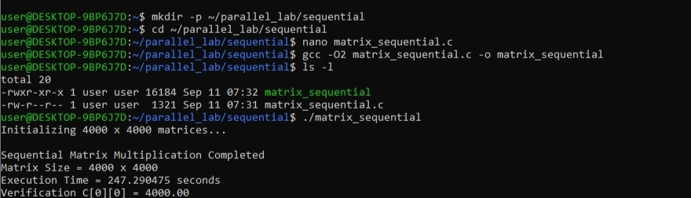

# PART A - Sequential Matrix Multiplication

## 1. Introduction

The Sequential implementation is used as the baseline for comparing the performance of parallel matrix multiplication approaches.

The experiment performs matrix multiplication of two 4000 × 4000 matrices using sequential CPU execution.

## 2. Sequential Matrix Multiplication Program

The Sequential matrix multiplication program was implemented in C using three nested loops for matrix multiplication.

The program uses a matrix size of 4000 × 4000.

```c
#include <stdio.h>
#include <stdlib.h>
#include <time.h>

#define N 4000

int main()
{
    int i, j, k;
    double *A, *B, *C;
    clock_t start, end;

    A = (double *)malloc(N * N * sizeof(double));
    B = (double *)malloc(N * N * sizeof(double));
    C = (double *)malloc(N * N * sizeof(double));

    if (A == NULL || B == NULL || C == NULL)
    {
        printf("Memory allocation failed\n");
        return 1;
    }

    printf("Initializing %d x %d matrices...\n", N, N);

    for (i = 0; i < N; i++)
    {
        for (j = 0; j < N; j++)
        {
            A[i * N + j] = 1.0;
            B[i * N + j] = 1.0;
            C[i * N + j] = 0.0;
        }
    }

    start = clock();

    for (i = 0; i < N; i++)
    {
        for (j = 0; j < N; j++)
        {
            for (k = 0; k < N; k++)
            {
                C[i * N + j] +=
                    A[i * N + k] * B[k * N + j];
            }
        }
    }

    end = clock();

    printf("\nSequential Matrix Multiplication Completed\n");
    printf("Matrix Size = %d x %d\n", N, N);
    printf("Execution Time = %f seconds\n",
           (double)(end - start) / CLOCKS_PER_SEC);
    printf("Verification C[0][0] = %.2f\n", C[0]);

    free(A);
    free(B);
    free(C);

    return 0;
}
```

## 3. Working and Output

The Sequential matrix multiplication program was created, compiled, and executed successfully. The output was verified for the 4000 × 4000 matrix.

### Compilation & Execution
```bash
gcc -O2 matrix_sequential.c -o matrix_sequential
./matrix_sequential
```

### Output


## 4. Result

The Sequential matrix multiplication completed successfully with an execution time of **244.120000 seconds**.

The verification value was **C[0][0] = 4000.00**, confirming the correctness of the matrix multiplication.
