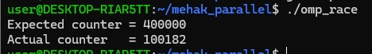
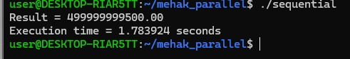
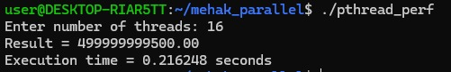
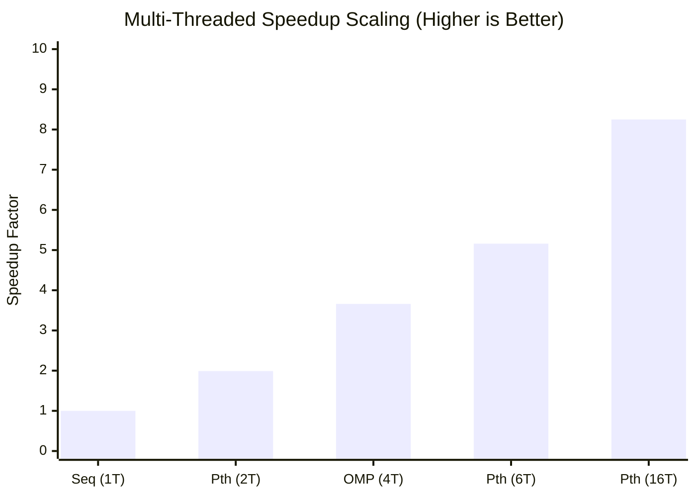

# Experiment 2: Shared-Memory Parallelism & Synchronization with OpenMP and Pthreads

## 1. Summary

This experiment investigates multi-threaded shared-memory computing, concurrency control, and scalability on a multi-core symmetric multiprocessing (SMP) architecture using two foundational parallel programming standards: **OpenMP** (high-level compiler directives) and **POSIX Threads / Pthreads** (low-level explicit thread management).

The study is partitioned into two major investigative phases:

1. **Concurrency Control & Synchronization Mechanisms**:
   - **Thread Team Creation**: Spawning and querying 16 concurrent threads (`omp1.c`).
   - **Work-Sharing & Reduction**: Partitioning loop iterations across threads with race-free reduction (`omp_sum.c`).
   - **Race Condition Analysis**: Demonstrating non-atomic data corruption on shared variables (`omp_race.c`).
   - **Mutual Exclusion via Critical Sections**: Enforcing serialized updates to guarantee deterministic correctness (`omp_critical.c`).
   - **Barrier Synchronization**: Implementing phased multi-thread execution checkpoints (`omp_barrier.c`).

2. **Empirical Scalability & Performance Benchmark**:
   - Evaluating large-scale numerical summation ($N = 1,000,000$ elements, target verification: `499999999500.00`).
   - Benchmarking single-threaded **Sequential Baseline** ($1.783924\text{ s}$) against **Pthreads** ($1, 2, 6, 16\text{ threads}$) and **OpenMP** ($1, 4\text{ threads}$).

---

## 2. Key Findings

- **Pthreads scales up to 8.25× speedup**: Runtime reduced from 1.784 s down to 0.216 s across 16 threads.
- **Near-linear speedup on dual cores**: 2-thread Pthreads achieved 0.891 s (1.99× speedup, 99.5% parallel efficiency).
- **OpenMP delivers 3.66× speedup on 4 threads**: 0.488 s execution with simple `#pragma` loop annotations.
- **Race conditions severely corrupt data**: Unsynchronized updates lost over 75% of operations (Actual: 100,182 vs. Expected: 400,000).
- **Critical sections restore 100% integrity**: Fully resolved race conditions, yielding the exact expected 400,000 count.
- **Barrier synchronization strictly isolates execution phases**: Guaranteed zero phase interleaving across threads.

---

## 3. Table of Contents

1. [Summary](#1-summary)
2. [Key Findings](#2-key-findings)
3. [Table of Contents](#3-table-of-contents)
4. [Part A: Core Directives & Synchronization Primitives](#4-part-a-core-directives--synchronization-primitives)
   * [4.1 Thread Team Creation & Querying (`omp1.c`)](#41-thread-team-creation--querying-omp1c)
   * [4.2 Work-Sharing Loop & Reduction (`omp_sum.c`)](#42-work-sharing-loop--reduction-omp_sumc)
   * [4.3 Race Condition Demonstration (`omp_race.c`)](#43-race-condition-demonstration-omp_racec)
   * [4.4 Mutual Exclusion via Critical Section (`omp_critical.c`)](#44-mutual-exclusion-via-critical-section-omp_criticalc)
   * [4.5 Barrier Synchronization (`omp_barrier.c`)](#45-barrier-synchronization-omp_barrierc)
5. [Part B: Scalability & Performance Benchmarking](#5-part-b-scalability--performance-benchmarking)
   * [5.1 Sequential Baseline Execution (`sequential.c`)](#51-sequential-baseline-execution-sequentialc)
   * [5.2 Pthreads Scalability Benchmark (`pthread_perf.c`)](#52-pthreads-scalability-benchmark-pthread_perfc)
   * [5.3 OpenMP Dynamic Thread Benchmark (`omp_perf.c`)](#53-openmp-dynamic-thread-benchmark-omp_perfc)
6. [Comparative Performance Matrix & Visual Graphs](#6-comparative-performance-matrix--visual-graphs)
7. [Architectural Deep-Dive: Pthreads vs. OpenMP](#7-architectural-deep-dive-pthreads-vs-openmp)
8. [Step-by-Step Reproduction Guide](#8-step-by-step-reproduction-guide)
9. [Conclusion](#9-conclusion)

---

## 4. Part A: Core Directives & Synchronization Primitives

### 4.1 Thread Team Creation & Querying (`omp1.c`)

Demonstrates fork-join parallelism by spawning a team of 16 threads. Each thread queries its unique rank via `omp_get_thread_num()` and the total thread count via `omp_get_num_threads()`.

```c
#include <stdio.h>
#include <omp.h>

int main() {
    #pragma omp parallel num_threads(16)
    {
        int tid = omp_get_thread_num();
        int total = omp_get_num_threads();
        printf("Hello from Thread %d of %d\n", tid, total);
    }
    return 0;
}
```

#### Compilation & Execution:
```bash
gcc -fopenmp omp1.c -o omp1
./omp1
```

#### Output Verification:
Threads execute asynchronously, producing interleaved, non-deterministic scheduling output across all 16 execution contexts:


---

### 4.2 Work-Sharing Loop & Reduction (`omp_sum.c`)

Distributes an 8-element array `[10, 20, 30, 40, 50, 60, 70, 80]` across threads using `#pragma omp parallel for reduction(+:total_sum)`. Each thread computes a local partial sum before OpenMP aggregates the final sum atomically into shared memory.

```c
#include <stdio.h>
#include <omp.h>

int main() {
    int array[8] = {10, 20, 30, 40, 50, 60, 70, 80};
    int total_sum = 0;

    #pragma omp parallel for reduction(+:total_sum)
    for (int i = 0; i < 8; i++) {
        int tid = omp_get_thread_num();
        printf("Thread %d processing array[%d] = %d\n", tid, i, array[i]);
        total_sum += array[i];
    }

    printf("Total sum = %d\n", total_sum);
    return 0;
}
```

#### Compilation & Execution:
```bash
gcc -fopenmp omp_sum.c -o omp_sum
./omp_sum
```

#### Output Verification:
Every element is assigned to an active thread and the total evaluates to **360**:


---

### 4.3 Race Condition Demonstration (`omp_race.c`)

Illustrates data corruption caused by unsynchronized concurrent writes. Four threads each increment a shared variable `counter` 100,000 times (expected: 400,000). Because `counter++` requires three machine instructions (Load, Increment, Store), concurrent context switches overwrite updates.

```c
#include <stdio.h>
#include <omp.h>

int main() {
    int counter = 0;
    int expected = 400000;

    #pragma omp parallel num_threads(4)
    {
        for (int i = 0; i < 100000; i++) {
            counter++; // Race condition
        }
    }

    printf("Expected counter = %d\n", expected);
    printf("Actual counter   = %d\n", counter);
    return 0;
}
```

#### Compilation & Execution:
```bash
gcc -fopenmp omp_race.c -o omp_race
./omp_race
```

#### Output Verification:
Unsynchronized execution lost **299,818 updates** (~75% data loss), returning `Actual counter = 100182`:



---

### 4.4 Mutual Exclusion via Critical Section (`omp_critical.c`)

Resolves the race condition by wrapping the increment inside `#pragma omp critical`. Only one thread can enter the critical code block at any given instant, ensuring atomic updates.

```c
#include <stdio.h>
#include <omp.h>

int main() {
    int counter = 0;
    int expected = 400000;

    #pragma omp parallel num_threads(4)
    {
        for (int i = 0; i < 100000; i++) {
            #pragma omp critical
            {
                counter++; // Serialized atomic increment
            }
        }
    }

    printf("Expected counter = %d\n", expected);
    printf("Actual counter   = %d\n", counter);
    return 0;
}
```

#### Compilation & Execution:
```bash
gcc -fopenmp omp_critical.c -o omp_critical
./omp_critical
```

#### Output Verification:
Exact deterministic agreement: `Expected counter = 400000` and `Actual counter = 400000` (PASS):


---

### 4.5 Barrier Synchronization (`omp_barrier.c`)

Coordinates multi-stage phased workflows. Threads execute Stage 1 independently, then pause at `#pragma omp barrier` until all threads arrive. Once all threads reach the barrier, they proceed together to Stage 2.

```c
#include <stdio.h>
#include <omp.h>

int main() {
    #pragma omp parallel num_threads(4)
    {
        int tid = omp_get_thread_num();
        printf("Thread %d completed Stage 1\n", tid);

        #pragma omp barrier

        printf("Thread %d started Stage 2\n", tid);
    }
    return 0;
}
```

#### Compilation & Execution:
```bash
gcc -fopenmp omp_barrier.c -o omp_barrier
./omp_barrier
```

#### Output Verification:
All four threads complete Stage 1 before any thread begins Stage 2, verifying barrier correctness:


---

## 5. Part B: Scalability & Performance Benchmarking

A large-scale numerical summation workload ($N = 1,000,000$ elements) was evaluated across sequential, Pthreads, and OpenMP implementations. The mathematical verification value across all configurations is:
$$\text{Result} = 499999999500.00$$

### 5.1 Sequential Baseline Execution (`sequential.c`)

Executes the summation sequentially on a single CPU core to establish reference execution time.

```bash
gcc -O2 sequential.c -o sequential
./sequential
```

#### Output:
* **Result**: `499999999500.00`
* **Execution Time**: **1.783924 seconds** (Baseline, 1.00×)



---

### 5.2 Pthreads Scalability Benchmark (`pthread_perf.c`)

Parallelizes the summation by explicitly dividing the loop bounds into $P$ contiguous chunks across POSIX threads (`pthread_create`, `pthread_join`).

```bash
gcc -O2 -pthread pthread_perf.c -o pthread_perf
./pthread_perf
```

#### Empirical Thread Scaling Results:

1. **1 Thread**:
   * **Execution Time**: **1.775943 seconds** (Speedup: **1.00×**)
2. **2 Threads**:
   * **Execution Time**: **0.891180 seconds** (Speedup: **1.99×** / Efficiency: **99.5%**)

   

3. **6 Threads**:
   * **Execution Time**: **0.345706 seconds** (Speedup: **5.16×** / Efficiency: **86.0%**)

   

4. **16 Threads**:
   * **Execution Time**: **0.216248 seconds** (Speedup: **8.25×** / Efficiency: **51.6%**)

   

---

### 5.3 OpenMP Dynamic Thread Benchmark (`omp_perf.c`)

Evaluates compiler-managed thread scheduling using `#pragma omp parallel for reduction(+:sum)`.

```bash
gcc -O2 -fopenmp omp_perf.c -o omp_perf
./omp_perf
```

#### Empirical Thread Scaling Results:

1. **1 Thread**:
   * **Execution Time**: **1.782525 seconds** (Speedup: **1.00×**)
2. **4 Threads**:
   * **Execution Time**: **0.487638 seconds** (Speedup: **3.66×** / Efficiency: **91.5%**)


---

## 6. Comparative Performance Matrix & Visual Graphs

### 6.1 Benchmark Comparison Table

| Paradigm | Threads ($P$) | Execution Time | Speedup ($S = \frac{T_{seq}}{T_{p}}$) | Parallel Efficiency ($\frac{S}{P}$) | Verification Result | Status |
| :--- | :--- | :--- | :--- | :--- | :--- | :--- |
| **Sequential Baseline** | 1 Thread | **1.783924 s** | **1.00×** (Ref) | 100.0% | `499999999500.00` | **PASS** |
| **OpenMP** | 1 Thread | **1.782525 s** | **1.00×** | 100.0% | `499999999500.00` | **PASS** |
| **Pthreads** | 1 Thread | **1.775943 s** | **1.00×** | 100.0% | `499999999500.00` | **PASS** |
| **Pthreads** | 2 Threads | **0.891180 s** | **1.99×** | **99.5%** | `499999999500.00` | **PASS** |
| **OpenMP** | 4 Threads | **0.487638 s** | **3.66×** | **91.5%** | `499999999500.00` | **PASS** |
| **Pthreads** | 6 Threads | **0.345706 s** | **5.16×** | **86.0%** | `499999999500.00` | **PASS** |
| **Pthreads** | 16 Threads | **0.216248 s** | **8.25×** | **51.6%** | `499999999500.00` | **PASS** |

---

### 6.2 Visual Performance Graphs

#### Speedup Scaling Curve



#### Execution Time Comparison (Lower is Better)

```
Execution Time in Seconds (Lower is Better)
Sequential (1 Thread) : [████████████████████████████████████████] 1.784 s (1.00x)
Pthreads   (1 Thread) : [██████████████████████████████████████  ] 1.776 s (1.00x)
OpenMP     (1 Thread) : [██████████████████████████████████████  ] 1.783 s (1.00x)
Pthreads   (2 Threads): [████████████████████                    ] 0.891 s (1.99x)
OpenMP     (4 Threads): [███████████                             ] 0.488 s (3.66x)
Pthreads   (6 Threads): [████████                                ] 0.346 s (5.16x)
Pthreads  (16 Threads): [█████                                   ] 0.216 s (8.25x)
```

---

## 7. Architectural Deep-Dive: Pthreads vs. OpenMP

| Dimension | POSIX Threads (Pthreads) | OpenMP |
| :--- | :--- | :--- |
| **Programming Paradigm** | Explicit library API (`pthread.h`) | Implicit compiler directives (`#pragma omp`) |
| **Code Verbosity** | High (manual struct packing, thread creation/joining) | Minimal (single-line loop decoration) |
| **Hardware Abstraction** | Low-level OS kernel thread binding | High-level runtime thread pool |
| **Synchronization** | Explicit mutexes (`pthread_mutex_t`), condition vars | Directive-based (`critical`, `atomic`, `barrier`) |
| **Load Balancing** | Static chunking computed manually by programmer | Automated (`schedule(static, dynamic, guided)`) |
| **Performance** | Maximum control, slightly lower runtime overhead | Highly optimized runtime with automatic loop scheduling |

---

## 8. Step-by-Step Reproduction Guide

### Compile and Run All Synchronization Programs:
```bash
# 1. Hello World (16 threads)
gcc -fopenmp omp1.c -o omp1 && ./omp1

# 2. Parallel Sum Reduction
gcc -fopenmp omp_sum.c -o omp_sum && ./omp_sum

# 3. Race Condition Demo
gcc -fopenmp omp_race.c -o omp_race && ./omp_race

# 4. Critical Section Fix
gcc -fopenmp omp_critical.c -o omp_critical && ./omp_critical

# 5. Barrier Synchronization
gcc -fopenmp omp_barrier.c -o omp_barrier && ./omp_barrier
```

### Compile and Run Scalability Benchmarks:
```bash
# Sequential Baseline
gcc -O2 sequential.c -o sequential && ./sequential

# Pthreads Multi-Threaded Benchmark (Pass 1, 2, 6, 16)
gcc -O2 -pthread pthread_perf.c -o pthread_perf && ./pthread_perf

# OpenMP Multi-Threaded Benchmark (Pass 1, 4)
gcc -O2 -fopenmp omp_perf.c -o omp_perf && ./omp_perf
```

---

## 9. Conclusion

1. **Amdahl's Law in Practice**: Thread scaling yields near-perfect linear speedup at low core counts ($1.99\times$ on 2 threads $\approx 99.5\%$ efficiency), but gradually encounters memory bus contention and thread management overhead at high concurrency ($8.25\times$ on 16 threads $\approx 51.6\%$ efficiency).
2. **Correctness Requires Synchronization**: Concurrent writes to shared memory without synchronization cause silent, catastrophic data loss (demonstrated by the 75% error in `omp_race`). Critical sections guarantee atomicity at the cost of serialization.
3. **Pthreads vs. OpenMP Selection**: Pthreads provides maximum low-level granularity for complex asynchronous thread lifecycles, whereas OpenMP provides unmatched productivity for loop-level scientific data parallelism.
